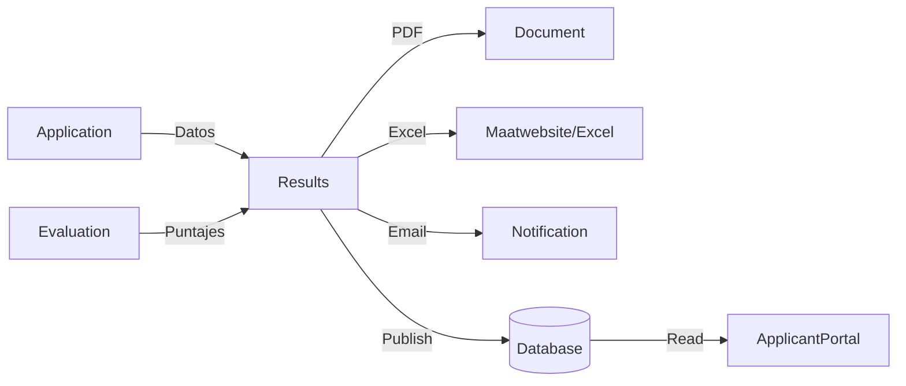

# 🎯 Análisis: ¿Módulo Results o Extender Application?

## 📋 Contexto del Problema

### Necesidades Identificadas

**Publicaciones de Resultados en 3 Fases**:
1. **Fase 4**: Publicación de postulantes APTOS (elegibilidad) ✅ Ya implementado
2. **Fase 7**: Publicación de resultados de Evaluación Curricular 📊 Pendiente
3. **Fase 9**: Publicación de resultados finales (post-entrevista) 🏆 Pendiente

**Requisitos de Exportación**:
- 📄 **PDF**: Listados oficiales de resultados por fase
- 📊 **Excel**: Datos tabulados para análisis (APTOS, NO APTOS, ranking)
- 📧 **Email**: Notificaciones masivas con resultados
- 🔒 **Control de visibilidad**: Publicar/despublicar por fase
- 📈 **Reportes estadísticos**: Por convocatoria, perfil, fase

### Módulos Actuales Disponibles

```
Modules/
├── Application/          # Gestión de postulaciones y estados
├── Document/            # Generación de PDFs con templates
├── Evaluation/          # Evaluación curricular (Fase 6)
├── JobPosting/          # Convocatorias y fases
└── ApplicantPortal/     # Portal del postulante
```

---

## 🔍 Análisis de Opciones

### Opción A: Crear Módulo `Results` (RECOMENDADO ✅)

**Estructura propuesta**:
```
Modules/Results/
├── app/
│   ├── Entities/
│   │   ├── ResultPublication.php         # Control de publicaciones
│   │   ├── ResultExport.php              # Historial de exportaciones
│   │   └── ResultNotification.php        # Notificaciones enviadas
│   ├── Services/
│   │   ├── ResultPublicationService.php  # Lógica de publicación
│   │   ├── ResultExportService.php       # Excel/PDF/CSV
│   │   ├── ResultNotificationService.php # Emails masivos
│   │   └── ResultStatisticsService.php   # Reportes y métricas
│   ├── Jobs/
│   │   ├── GenerateResultPdfJob.php      # PDF en background
│   │   ├── GenerateResultExcelJob.php    # Excel en background
│   │   └── SendResultNotificationsJob.php # Emails batch
│   ├── Http/
│   │   └── Controllers/
│   │       ├── Admin/
│   │       │   ├── ResultPublicationController.php
│   │       │   └── ResultExportController.php
│   │       └── Applicant/
│   │           └── MyResultsController.php
│   ├── Events/
│   │   ├── ResultsPublished.php
│   │   ├── ResultsUnpublished.php
│   │   └── ResultExportCompleted.php
│   └── Exports/
│       ├── EligibilityResultsExport.php  # Fase 4
│       ├── CurriculumResultsExport.php   # Fase 7
│       └── FinalResultsExport.php        # Fase 9
└── database/
    └── migrations/
        ├── xxx_create_result_publications_table.php
        ├── xxx_create_result_exports_table.php
        └── xxx_create_result_notifications_table.php
```

**Ventajas** ✅:
1. **Separación de responsabilidades clara** (SOLID)
   - `Application`: Gestiona postulaciones
   - `Evaluation`: Gestiona evaluaciones curricular
   - `Results`: Gestiona publicación y exportación de resultados

2. **Escalabilidad**
   - Fácil agregar nuevas fases de publicación
   - Nuevos formatos de exportación sin tocar Application
   - Independiente de cambios en Application/Evaluation

3. **Reutilización**
   - Sirve para resultados de Fase 4, 7 y 9
   - Puede usarse para futuras fases si se necesitan
   - API REST fácil de exponer

4. **Mejor testing**
   - Tests unitarios aislados por módulo
   - Mocks más simples
   - CI/CD independiente

5. **Mantenibilidad**
   - Equipo puede trabajar en Results sin afectar Application
   - Bugs aislados por módulo
   - Logs separados

6. **Auditoría robusta**
   - Historial de publicaciones por fase
   - Tracking de exportaciones
   - Notificaciones enviadas con estado

**Desventajas** ⚠️:
1. Más archivos y estructura
2. Requiere coordinación entre módulos
3. Dependencias cruzadas (pero controladas)

---

### Opción B: Extender Módulo `Application`

**Estructura extendida**:
```
Modules/Application/
├── app/
│   ├── Services/
│   │   ├── ApplicationService.php
│   │   ├── AutoGraderService.php
│   │   ├── ApplicationExportService.php     # NUEVO
│   │   └── ApplicationNotificationService.php # NUEVO
│   └── Exports/
│       └── ApplicationsExport.php            # NUEVO
```

**Ventajas** ✅:
1. Todo en un solo módulo (simplicidad)
2. Sin dependencias entre módulos
3. Menos configuración inicial

**Desventajas** ⚠️:
1. **Violación de SRP** (Single Responsibility Principle)
   - Application hace demasiado: CRUD + Evaluación + Publicación + Exportación
2. **Dificulta escalabilidad**
   - Agregar fase 7 y 9 hinchan aún más el módulo
3. **Testing complejo**
   - Tests mezclados entre postulación y resultados
4. **Mantenibilidad baja**
   - Cambios en exportación pueden romper lógica de postulación
5. **No reutilizable**
   - Si Evaluation también necesita exportar, duplicamos código

---

### Opción C: Usar Módulo `Document` Extendido

**Idea**: Aprovechar `Document` ya que genera PDFs.

**Análisis**:
- ✅ `Document` es perfecto para generar PDFs individuales (ficha de postulación)
- ❌ No está diseñado para:
  - Publicaciones masivas
  - Exportación Excel
  - Control de visibilidad por fase
  - Notificaciones batch

**Conclusión**: `Document` se usa como **servicio auxiliar**, no como módulo principal.

---

## 🏆 Recomendación Final: Opción A (Módulo Results)

### Justificación

**1. Arquitectura Limpia (Clean Architecture)**
```
┌─────────────────────────────────────────┐
│         Capa de Presentación           │
│  (Controllers, Views, API)             │
└─────────────────────────────────────────┘
              ↓
┌─────────────────────────────────────────┐
│      Capa de Lógica de Negocio         │
│                                         │
│  Application ←→ Results ←→ Evaluation  │
│       ↓             ↓            ↓      │
│    AutoGrader   Publisher   Grader     │
└─────────────────────────────────────────┘
              ↓
┌─────────────────────────────────────────┐
│         Servicios Auxiliares            │
│                                         │
│    Document  ←  Notification  ←  Email │
└─────────────────────────────────────────┘
```

**2. Responsabilidades Claras**

| Módulo | Responsabilidad | Ejemplos |
|--------|----------------|----------|
| `Application` | Gestionar postulaciones | CRUD, estados, historial |
| `Evaluation` | Evaluar currículos | Calificaciones, ranking |
| `Results` | Publicar resultados | PDF, Excel, notificaciones |
| `Document` | Generar PDFs | Templates, renderizado |

**3. Flujo de Datos**



**4. Escalabilidad Futura**

```php
// Fácil agregar nueva fase de publicación
class ResultPublicationService
{
    public function publishPhase4Results($posting) { } // Elegibilidad
    public function publishPhase7Results($posting) { } // Curricular
    public function publishPhase9Results($posting) { } // Final
    public function publishPhase12Results($posting) { } // Futuro
}
```

---

## 📐 Diseño Detallado del Módulo Results

### 1. Entidad `ResultPublication`

```php
<?php

namespace Modules\Results\Entities;

use Illuminate\Database\Eloquent\Model;
use Modules\Results\Enums\PublicationPhaseEnum;
use Modules\Results\Enums\PublicationStatusEnum;

class ResultPublication extends Model
{
    protected $fillable = [
        'job_posting_id',
        'phase',                    // PHASE_04, PHASE_07, PHASE_09
        'status',                   // draft, published, unpublished
        'title',                    // "Resultados de Evaluación Curricular"
        'description',
        'published_at',
        'published_by',
        'unpublished_at',
        'unpublished_by',
        'total_applicants',
        'total_eligible',
        'total_not_eligible',
        'pdf_path',                 // Listado oficial en PDF
        'excel_path',               // Datos exportados en Excel
        'metadata',                 // JSON con estadísticas extra
    ];

    protected $casts = [
        'phase' => PublicationPhaseEnum::class,
        'status' => PublicationStatusEnum::class,
        'published_at' => 'datetime',
        'unpublished_at' => 'datetime',
        'metadata' => 'array',
    ];

    // Relaciones
    public function jobPosting() { }
    public function publisher() { }
    public function exports() { }
    public function notifications() { }
}
```

### 2. Servicio Principal `ResultPublicationService`

```php
<?php

namespace Modules\Results\Services;

use Modules\Results\Entities\ResultPublication;
use Modules\Results\Jobs\GenerateResultPdfJob;
use Modules\Results\Jobs\GenerateResultExcelJob;
use Modules\Results\Jobs\SendResultNotificationsJob;
use Modules\Application\Entities\Application;
use Modules\JobPosting\Entities\JobPosting;

class ResultPublicationService
{
    public function __construct(
        private ResultExportService $exportService,
        private ResultNotificationService $notificationService
    ) {}

    /**
     * Publicar resultados de Fase 4 (Elegibilidad)
     */
    public function publishPhase4Results(
        JobPosting $posting,
        bool $sendNotifications = true
    ): ResultPublication {

        // 1. Validar que no se haya publicado
        $existing = ResultPublication::where('job_posting_id', $posting->id)
            ->where('phase', 'PHASE_04')
            ->where('status', 'published')
            ->first();

        if ($existing) {
            throw new \Exception('Los resultados de Fase 4 ya fueron publicados');
        }

        // 2. Obtener datos
        $applications = Application::whereHas('vacancy.jobProfile.jobPosting',
                fn($q) => $q->where('id', $posting->id)
            )
            ->with(['vacancy.jobProfile', 'applicant'])
            ->get();

        $stats = [
            'total' => $applications->count(),
            'eligible' => $applications->where('is_eligible', true)->count(),
            'not_eligible' => $applications->where('is_eligible', false)->count(),
        ];

        // 3. Crear publicación
        $publication = ResultPublication::create([
            'job_posting_id' => $posting->id,
            'phase' => 'PHASE_04',
            'status' => 'published',
            'title' => "Resultados de Evaluación de Elegibilidad - {$posting->code}",
            'published_at' => now(),
            'published_by' => auth()->id(),
            'total_applicants' => $stats['total'],
            'total_eligible' => $stats['eligible'],
            'total_not_eligible' => $stats['not_eligible'],
        ]);

        // 4. Generar PDF y Excel en background
        GenerateResultPdfJob::dispatch($publication, $applications, 'PHASE_04');
        GenerateResultExcelJob::dispatch($publication, $applications, 'PHASE_04');

        // 5. Enviar notificaciones (opcional)
        if ($sendNotifications) {
            SendResultNotificationsJob::dispatch($publication);
        }

        // 6. Actualizar flag en JobPosting
        $posting->update([
            'results_published' => true,
            'results_published_at' => now(),
            'results_published_by' => auth()->id()
        ]);

        // 7. Disparar evento
        event(new ResultsPublished($publication));

        return $publication;
    }

    /**
     * Publicar resultados de Fase 7 (Evaluación Curricular)
     */
    public function publishPhase7Results(JobPosting $posting): ResultPublication
    {
        // Similar a publishPhase4Results pero con datos de Evaluation
        $evaluations = \Modules\Evaluation\Entities\Evaluation::whereHas('application.vacancy.jobProfile.jobPosting',
                fn($q) => $q->where('id', $posting->id)
            )
            ->with(['application.applicant', 'evaluators'])
            ->get();

        // Calcular ranking, puntajes, etc.
        $rankedApplications = $evaluations->sortByDesc('total_score');

        // Crear publicación...
    }

    /**
     * Despublicar resultados (ocultar)
     */
    public function unpublishResults(ResultPublication $publication): void
    {
        $publication->update([
            'status' => 'unpublished',
            'unpublished_at' => now(),
            'unpublished_by' => auth()->id()
        ]);

        event(new ResultsUnpublished($publication));
    }
}
```

### 3. Servicio de Exportación `ResultExportService`

```php
<?php

namespace Modules\Results\Services;

use Modules\Results\Entities\ResultPublication;
use Modules\Results\Exports\EligibilityResultsExport;
use Modules\Document\Services\DocumentService;
use Maatwebsite\Excel\Facades\Excel;
use Illuminate\Support\Facades\Storage;

class ResultExportService
{
    public function __construct(
        private DocumentService $documentService
    ) {}

    /**
     * Generar PDF de resultados
     */
    public function generatePdf(
        ResultPublication $publication,
        $applications,
        string $phase
    ): string {

        // 1. Preparar datos para el template
        $data = [
            'publication' => $publication,
            'posting' => $publication->jobPosting,
            'applications' => $applications,
            'stats' => [
                'total' => $applications->count(),
                'eligible' => $applications->where('is_eligible', true)->count(),
                'not_eligible' => $applications->where('is_eligible', false)->count(),
            ],
            'generated_at' => now()->format('d/m/Y H:i:s'),
            'phase' => $phase
        ];

        // 2. Obtener template según fase
        $templateCode = match($phase) {
            'PHASE_04' => 'RESULT_ELIGIBILITY',
            'PHASE_07' => 'RESULT_CURRICULUM',
            'PHASE_09' => 'RESULT_FINAL',
            default => throw new \Exception("Template no encontrado para fase {$phase}")
        };

        $template = \Modules\Document\Entities\DocumentTemplate::where('code', $templateCode)
            ->firstOrFail();

        // 3. Generar PDF usando DocumentService
        $document = $this->documentService->generateFromTemplate(
            $template,
            $publication,
            $data
        );

        // 4. Actualizar publication con ruta del PDF
        $publication->update(['pdf_path' => $document->pdf_path]);

        return $document->pdf_path;
    }

    /**
     * Generar Excel de resultados
     */
    public function generateExcel(
        ResultPublication $publication,
        $applications,
        string $phase
    ): string {

        // 1. Seleccionar clase de exportación
        $exportClass = match($phase) {
            'PHASE_04' => new EligibilityResultsExport($publication, $applications),
            'PHASE_07' => new CurriculumResultsExport($publication, $applications),
            'PHASE_09' => new FinalResultsExport($publication, $applications),
        };

        // 2. Generar archivo
        $filename = "resultados_{$phase}_{$publication->jobPosting->code}_" . now()->format('Ymd_His') . ".xlsx";
        $path = "exports/results/{$publication->id}/{$filename}";

        Excel::store($exportClass, $path, 'public');

        // 3. Actualizar publication
        $publication->update(['excel_path' => $path]);

        return $path;
    }

    /**
     * Generar CSV (alternativa ligera)
     */
    public function generateCsv(ResultPublication $publication, $applications): string
    {
        // Similar a Excel pero formato CSV
    }
}
```

### 4. Export de Excel `EligibilityResultsExport`

```php
<?php

namespace Modules\Results\Exports;

use Maatwebsite\Excel\Concerns\FromCollection;
use Maatwebsite\Excel\Concerns\WithHeadings;
use Maatwebsite\Excel\Concerns\WithStyles;
use Maatwebsite\Excel\Concerns\WithTitle;
use PhpOffice\PhpSpreadsheet\Worksheet\Worksheet;

class EligibilityResultsExport implements FromCollection, WithHeadings, WithStyles, WithTitle
{
    public function __construct(
        private $publication,
        private $applications
    ) {}

    public function collection()
    {
        return $this->applications->map(function($app, $index) {
            return [
                'N°' => $index + 1,
                'DNI' => $app->dni,
                'Apellidos y Nombres' => strtoupper($app->full_name),
                'Perfil' => $app->vacancy->jobProfile->profile_name,
                'Resultado' => $app->is_eligible ? 'APTO' : 'NO APTO',
                'Observaciones' => $app->ineligibility_reason ?? '-',
                'Fecha Postulación' => $app->application_date->format('d/m/Y'),
            ];
        });
    }

    public function headings(): array
    {
        return [
            'N°',
            'DNI',
            'Apellidos y Nombres',
            'Perfil Postulado',
            'Resultado',
            'Observaciones',
            'Fecha Postulación'
        ];
    }

    public function styles(Worksheet $sheet)
    {
        return [
            1 => ['font' => ['bold' => true], 'fill' => [
                'fillType' => \PhpOffice\PhpSpreadsheet\Style\Fill::FILL_SOLID,
                'startColor' => ['rgb' => '4472C4']
            ]],
        ];
    }

    public function title(): string
    {
        return 'Resultados Elegibilidad';
    }
}
```

### 5. Job de Notificaciones `SendResultNotificationsJob`

```php
<?php

namespace Modules\Results\Jobs;

use Illuminate\Bus\Queueable;
use Illuminate\Contracts\Queue\ShouldQueue;
use Illuminate\Foundation\Bus\Dispatchable;
use Illuminate\Queue\InteractsWithQueue;
use Modules\Results\Entities\ResultPublication;
use Modules\Results\Services\ResultNotificationService;

class SendResultNotificationsJob implements ShouldQueue
{
    use Dispatchable, InteractsWithQueue, Queueable;

    public $timeout = 600; // 10 minutos

    public function __construct(
        public ResultPublication $publication
    ) {}

    public function handle(ResultNotificationService $notificationService): void
    {
        $applications = $this->publication->jobPosting
            ->jobProfiles()
            ->with('vacancies.applications.applicant')
            ->get()
            ->flatMap(fn($profile) => $profile->vacancies)
            ->flatMap(fn($vacancy) => $vacancy->applications);

        // Enviar por lotes de 50
        $applications->chunk(50)->each(function($batch) use ($notificationService) {
            foreach ($batch as $application) {
                $notificationService->sendResultNotification(
                    $application,
                    $this->publication
                );
            }
        });
    }
}
```

---

## 🔄 Integración con Módulos Existentes

### 1. Application → Results

```php
// En Application, agregar relación
class Application extends Model
{
    public function resultPublications()
    {
        return $this->hasManyThrough(
            ResultPublication::class,
            JobPosting::class,
            'id',
            'job_posting_id',
            'job_posting_id',
            'id'
        );
    }

    public function canViewResults(string $phase): bool
    {
        $publication = ResultPublication::where('job_posting_id', $this->vacancy->jobProfile->job_posting_id)
            ->where('phase', $phase)
            ->where('status', 'published')
            ->first();

        return $publication !== null;
    }
}
```

### 2. JobPosting → Results

```php
// En JobPosting
class JobPosting extends Model
{
    public function resultPublications()
    {
        return $this->hasMany(ResultPublication::class);
    }

    public function getPublishedResults(string $phase = null)
    {
        $query = $this->resultPublications()->where('status', 'published');

        if ($phase) {
            $query->where('phase', $phase);
        }

        return $query->latest('published_at')->get();
    }
}
```

### 3. Document → Results (Servicio auxiliar)

```php
// Results usa Document como servicio
class ResultExportService
{
    public function __construct(
        private DocumentService $documentService
    ) {}

    public function generatePdf(...)
    {
        // Usa DocumentService para generar PDFs
        $this->documentService->generateFromTemplate(...);
    }
}
```

---

## 📊 Comparación Final

| Criterio | Módulo Results | Extender Application | Usar Document |
|----------|---------------|---------------------|---------------|
| Separación de responsabilidades | ✅ Excelente | ❌ Pobre | ⚠️ Regular |
| Escalabilidad | ✅ Alta | ❌ Baja | ⚠️ Media |
| Mantenibilidad | ✅ Alta | ❌ Baja | ⚠️ Media |
| Testing | ✅ Fácil | ❌ Difícil | ⚠️ Regular |
| Reutilización | ✅ Alta | ❌ Baja | ❌ Baja |
| Complejidad inicial | ⚠️ Media | ✅ Baja | ✅ Baja |
| Costo de desarrollo | ⚠️ 3-5 días | ✅ 1-2 días | ✅ 2-3 días |
| Deuda técnica | ✅ Nula | ❌ Alta | ⚠️ Media |

---

## ✅ Decisión Recomendada

### **Crear Módulo `Results` Independiente**

**Razones finales**:

1. **Necesitas publicar resultados en 3 fases diferentes** → Un módulo centralizado evita duplicación
2. **Exportaciones múltiples (PDF, Excel, CSV)** → Mejor tenerlo separado
3. **Notificaciones masivas** → Servicio especializado
4. **Historial y auditoría** → Entidad `ResultPublication` con tracking completo
5. **Futuro**: Si agregan más fases, solo extiendes Results, no tocas Application

**ROI (Return on Investment)**:
- Inversión inicial: 3-5 días de desarrollo
- Ahorro futuro: 70% menos tiempo en Fase 7 y Fase 9
- Mantenibilidad: Bugs aislados, testing independiente
- Escalabilidad: Agregar nuevas fases sin refactorizar

---

## 🚀 Plan de Implementación

### Fase 1: Base del Módulo (Día 1-2)
- [ ] Crear estructura del módulo Results con Nwidart
- [ ] Migraciones de `result_publications`, `result_exports`, `result_notifications`
- [ ] Entidades básicas
- [ ] Enums: `PublicationPhaseEnum`, `PublicationStatusEnum`

### Fase 2: Servicios Core (Día 2-3)
- [ ] `ResultPublicationService` con `publishPhase4Results()`
- [ ] `ResultExportService` con PDF y Excel
- [ ] Integración con `DocumentService` para PDFs

### Fase 3: Jobs y Exports (Día 3-4)
- [ ] Jobs: `GenerateResultPdfJob`, `GenerateResultExcelJob`, `SendResultNotificationsJob`
- [ ] Export: `EligibilityResultsExport` con estilos Excel

### Fase 4: Controladores y Rutas (Día 4)
- [ ] `ResultPublicationController` (Admin)
- [ ] `MyResultsController` (Applicant Portal)
- [ ] Rutas y middleware

### Fase 5: Vistas y Testing (Día 5)
- [ ] Dashboard admin de publicación
- [ ] Vista de resultados para postulantes
- [ ] Tests unitarios y de integración

---

## 📝 Conclusión

**Crear el módulo `Results` es la mejor decisión arquitectónica** porque:

✅ Sigue principios SOLID
✅ Facilita escalabilidad para Fase 7 y 9
✅ Mejor testing y mantenibilidad
✅ ROI positivo a mediano plazo
✅ Código limpio y profesional

La pequeña inversión inicial (2-3 días extra vs extender Application) se recupera completamente al implementar Fase 7 y 9, donde solo tendrás que agregar métodos nuevos al servicio existente en lugar de refactorizar todo Application.

---

**Versión**: 1.0
**Fecha**: 2026-01-09
**Recomendación**: ✅ Crear módulo Results
