# 🤖 Sistema de Evaluación Automática de Elegibilidad

## 📋 Índice
1. [Visión General](#visión-general)
2. [Arquitectura del Sistema](#arquitectura-del-sistema)
3. [Flujo Completo de Evaluación](#flujo-completo-de-evaluación)
4. [Componentes del Sistema](#componentes-del-sistema)
5. [Implementación Detallada](#implementación-detallada)
6. [Testing y Validación](#testing-y-validación)
7. [Monitoreo y Logs](#monitoreo-y-logs)
8. [Mejores Prácticas](#mejores-prácticas)

---

## 🎯 Visión General

### Propósito
El **Sistema de Evaluación Automática** (AutoGrader) permite evaluar masivamente todas las postulaciones de una convocatoria al finalizar la Fase 3 (Registro de Postulantes), determinando automáticamente si cada postulante es **APTO** o **NO_APTO** según los requisitos del perfil del puesto.

### Características Principales
- ✅ Evaluación automática basada en reglas de negocio
- ✅ Procesamiento por lotes (batch processing)
- ✅ Generación de reportes detallados
- ✅ Sistema de auditoría completo
- ✅ Publicación controlada de resultados
- ✅ Manejo de errores robusto
- ✅ Logs detallados para debugging

### Beneficios
- ⚡ **Rapidez**: Evalúa cientos de postulaciones en segundos
- 🎯 **Consistencia**: Aplica los mismos criterios a todos los postulantes
- 📊 **Trazabilidad**: Registro completo de evaluaciones y decisiones
- 🔒 **Seguridad**: Control de permisos y validación de estados

---

## 🏗️ Arquitectura del Sistema

### Módulos Involucrados (Nwidart)

```
Modules/
├── Application/          ← Módulo principal
│   ├── Services/
│   │   ├── AutoGraderService.php          # Evaluador automático
│   │   ├── EligibilityCalculatorService.php # Calculadora de experiencia
│   │   └── ApplicationService.php         # Gestión de postulaciones
│   ├── Console/
│   │   └── EvaluateApplicationsCommand.php # Comando Artisan
│   ├── Jobs/
│   │   ├── EvaluateApplicationBatch.php   # Job para procesar lotes
│   │   └── GenerateEligibilityReport.php  # Job para generar reportes
│   ├── Events/
│   │   ├── ApplicationEvaluated.php       # Evento cuando se evalúa
│   │   └── BatchEvaluationCompleted.php   # Evento de lote completo
│   └── Entities/
│       ├── Application.php
│       ├── ApplicationAcademic.php
│       ├── ApplicationExperience.php
│       └── ApplicationHistory.php
│
├── JobProfile/          ← Requisitos del puesto
│   └── Entities/
│       └── JobProfile.php
│
└── JobPosting/          ← Control de publicación
    └── Entities/
        └── JobPosting.php
```

### Diagrama de Flujo

```mermaid
graph TD
    A[Admin: Cierra Fase 3] --> B{Verificar estado}
    B -->|Válido| C[Ejecutar Evaluación]
    B -->|Inválido| Z[Error: Fase incorrecta]

    C --> D[AutoGraderService]
    D --> E[Por cada Application]

    E --> F[Validar Académicos]
    E --> G[Validar Exp. General]
    E --> H[Validar Exp. Específica]
    E --> I[Validar Registros Prof.]

    F --> J{¿Cumple?}
    G --> J
    H --> J
    I --> J

    J -->|Sí| K[Marcar APTO]
    J -->|No| L[Marcar NO_APTO]

    K --> M[Guardar en BD]
    L --> M
    M --> N[Registrar en History]
    N --> O[Disparar Evento]

    O --> P{¿Todos evaluados?}
    P -->|No| E
    P -->|Sí| Q[Generar Reporte]

    Q --> R[Admin: Revisar Resultados]
    R --> S{¿Publicar?}
    S -->|Sí| T[Publicar Resultados]
    S -->|No| U[Modificar manualmente]

    T --> V[Notificar Postulantes]
```



---

## 🔄 Flujo Completo de Evaluación

### Fase 1: Preparación (Pre-evaluación)

```php
// 1. Verificar que la fase actual sea correcta
$posting = JobPosting::findOrFail($postingId);
$currentPhase = $posting->getCurrentPhase();

if (!$currentPhase || $currentPhase->phase->code !== 'PHASE_03_REGISTRATION') {
    throw new InvalidPhaseException('La evaluación solo puede ejecutarse después de cerrar la Fase 3');
}

// 2. Verificar que no se haya evaluado previamente
if ($posting->results_published) {
    throw new AlreadyEvaluatedException('Los resultados ya fueron publicados');
}

// 3. Obtener todas las postulaciones presentadas
$applications = Application::where('status', ApplicationStatus::SUBMITTED)
    ->whereHas('vacancy.jobProfile.jobPosting', fn($q) => $q->where('id', $postingId))
    ->with([
        'academics.career',
        'experiences',
        'trainings',
        'specialConditions',
        'professionalRegistrations',
        'knowledge',
        'vacancy.jobProfile.careers'
    ])
    ->get();

// 4. Validar que haya postulaciones
if ($applications->isEmpty()) {
    throw new NoApplicationsException('No hay postulaciones para evaluar');
}
```

### Fase 2: Evaluación Masiva

```php
use Illuminate\Support\Facades\DB;
use Illuminate\Support\Facades\Log;

DB::beginTransaction();
try {
    $stats = [
        'total' => $applications->count(),
        'eligible' => 0,
        'not_eligible' => 0,
        'errors' => 0,
        'details' => []
    ];

    foreach ($applications as $application) {
        try {
            // Evaluar elegibilidad
            $result = app(AutoGraderService::class)->evaluateEligibility($application);

            // Actualizar estado
            $application->update([
                'is_eligible' => $result['is_eligible'],
                'status' => $result['is_eligible']
                    ? ApplicationStatus::ELIGIBLE
                    : ApplicationStatus::NOT_ELIGIBLE,
                'ineligibility_reason' => $result['is_eligible']
                    ? null
                    : implode("\n", $result['reasons']),
                'eligibility_checked_at' => now(),
                'eligibility_checked_by' => auth()->id(),
            ]);

            // Registrar en historial
            $application->history()->create([
                'action' => 'eligibility_evaluated',
                'performed_by' => auth()->id(),
                'performed_at' => now(),
                'details' => [
                    'result' => $result['is_eligible'] ? 'APTO' : 'NO_APTO',
                    'reasons' => $result['reasons'],
                    'evaluation_details' => $result['details']
                ]
            ]);

            // Actualizar estadísticas
            if ($result['is_eligible']) {
                $stats['eligible']++;
            } else {
                $stats['not_eligible']++;
            }

            $stats['details'][] = [
                'application_id' => $application->id,
                'applicant_name' => $application->full_name,
                'result' => $result['is_eligible'] ? 'APTO' : 'NO_APTO',
                'reasons' => $result['reasons']
            ];

            // Disparar evento
            event(new ApplicationEvaluated($application, $result));

        } catch (\Exception $e) {
            $stats['errors']++;
            Log::error('Error evaluando postulación', [
                'application_id' => $application->id,
                'error' => $e->getMessage(),
                'trace' => $e->getTraceAsString()
            ]);
        }
    }

    DB::commit();

    // Disparar evento de lote completo
    event(new BatchEvaluationCompleted($posting, $stats));

    return $stats;

} catch (\Exception $e) {
    DB::rollBack();
    Log::error('Error en evaluación masiva', [
        'posting_id' => $postingId,
        'error' => $e->getMessage()
    ]);
    throw $e;
}
```

### Fase 3: Publicación de Resultados

```php
// Solo después de que el admin revise y confirme
public function publishResults(Request $request, string $postingId)
{
    // 1. Validar permisos
    $this->authorize('publish-results', Application::class);

    // 2. Validar que no se haya publicado
    $posting = JobPosting::findOrFail($postingId);

    if ($posting->results_published) {
        return redirect()->back()->with('error', 'Los resultados ya fueron publicados');
    }

    // 3. Publicar resultados
    DB::transaction(function () use ($posting) {
        $posting->update([
            'results_published' => true,
            'results_published_at' => now(),
            'results_published_by' => auth()->id()
        ]);

        // 4. Cambiar estado de convocatoria
        $posting->update([
            'status' => JobPostingStatusEnum::EN_EVALUACION
        ]);

        // 5. Disparar evento para notificaciones
        event(new ResultsPublished($posting));
    });

    return redirect()->back()->with('success', 'Resultados publicados correctamente');
}
```

---

## 🔧 Componentes del Sistema

### 1. AutoGraderService (Núcleo del Sistema)

**Ubicación**: `Modules/Application/app/Services/AutoGraderService.php`

**Responsabilidades**:
- Evaluar elegibilidad de postulaciones
- Aplicar reglas de negocio
- Generar razones de no elegibilidad
- Actualizar estado de postulaciones

**Métodos principales**:

```php
class AutoGraderService
{
    /**
     * Evaluar elegibilidad completa
     *
     * @return array [
     *   'is_eligible' => bool,
     *   'reasons' => array,
     *   'details' => [
     *     'academics' => [...],
     *     'general_experience' => [...],
     *     'specific_experience' => [...],
     *     ...
     *   ]
     * ]
     */
    public function evaluateEligibility(Application $application): array;

    /**
     * Aplicar evaluación y actualizar BD
     */
    public function applyAutoGrading(Application $application, string $checkedBy): Application;

    // Validaciones específicas (privadas)
    private function validateAcademics(Application $application, $jobProfile): array;
    private function validateGeneralExperience(Application $application, $jobProfile): array;
    private function validateSpecificExperience(Application $application, $jobProfile): array;
    private function validateProfessionalRegistry(Application $application, $jobProfile): array;
    private function validateOsceCertification(Application $application): array;
    private function validateDriverLicense(Application $application): array;
}
```

**Criterios de Evaluación**:

| Criterio | Requisito | Fuente | Validación |
|----------|-----------|--------|------------|
| **Nivel Educativo** | `JobProfile->education_levels` | `Application->academics` | Debe tener al menos un grado igual o superior |
| **Carrera Profesional** | `JobProfile->careers()` (pivote) | `Application->academics->career_id` | Debe coincidir con carreras aceptadas (incluye equivalencias) |
| **Exp. General** | `JobProfile->general_experience_years` | `Application->experiences` | Tiempo total ≥ requerido (sin overlaps) |
| **Exp. Específica** | `JobProfile->specific_experience_years` | `Application->experiences (is_specific=true)` | Tiempo específico ≥ requerido |
| **Colegiatura** | `JobProfile->colegiatura_required` | `Application->professionalRegistrations` | Debe tener registro vigente |
| **OSCE** | `JobProfile->requires_osce_certification` | `Application->professionalRegistrations` | Certificación vigente |
| **Licencia Conducir** | `JobProfile->requires_driver_license` | `Application->professionalRegistrations` | Licencia vigente |

### 2. EligibilityCalculatorService (Cálculo de Experiencia)

**Ubicación**: `Modules/Application/app/Services/EligibilityCalculatorService.php`

**Responsabilidades**:
- Calcular tiempo total de experiencia
- Detectar y fusionar overlaps (superposiciones)
- Formatear tiempo en "X años, Y meses, Z días"
- Validar fechas

**Algoritmo de Fusión de Overlaps**:

```php
/**
 * Ejemplo de fusión:
 *
 * Experiencia 1: 2020-01-01 a 2021-12-31 (2 años)
 * Experiencia 2: 2021-06-01 a 2022-06-30 (1 año, superpone 7 meses)
 *
 * Resultado fusionado: 2020-01-01 a 2022-06-30 (2.5 años)
 *
 * Sin fusión (incorrecto): 3 años
 * Con fusión (correcto): 2.5 años
 */
private function mergeOverlappingPeriods(array $periods): array
{
    if (empty($periods)) return [];

    // 1. Ordenar por fecha de inicio
    usort($periods, fn($a, $b) => $a['start']->timestamp <=> $b['start']->timestamp);

    $merged = [];
    $current = $periods[0];

    for ($i = 1; $i < count($periods); $i++) {
        $next = $periods[$i];

        // 2. Verificar overlap
        if ($next['start']->lessThanOrEqualTo($current['end']->addDay())) {
            // Fusionar: tomar el end_date más lejano
            $current['end'] = max($current['end'], $next['end']);
        } else {
            // No hay overlap, guardar y continuar
            $merged[] = $current;
            $current = $next;
        }
    }

    $merged[] = $current;
    return $merged;
}
```

### 3. Comando Artisan

**Ubicación**: `Modules/Application/app/Console/EvaluateApplicationsCommand.php`

```php
<?php

namespace Modules\Application\Console;

use Illuminate\Console\Command;
use Modules\Application\Services\AutoGraderService;
use Modules\Application\Entities\Application;
use Modules\Application\Enums\ApplicationStatus;
use Modules\JobPosting\Entities\JobPosting;

class EvaluateApplicationsCommand extends Command
{
    protected $signature = 'applications:evaluate
                            {posting : ID de la convocatoria}
                            {--dry-run : Simular sin guardar cambios}
                            {--user= : ID del usuario que ejecuta (default: system)}';

    protected $description = 'Evaluar elegibilidad automática de postulaciones de una convocatoria';

    public function __construct(
        private AutoGraderService $autoGrader
    ) {
        parent::__construct();
    }

    public function handle(): int
    {
        $postingId = $this->argument('posting');
        $dryRun = $this->option('dry-run');
        $userId = $this->option('user') ?? 'system';

        $this->info("🚀 Iniciando evaluación automática para convocatoria: {$postingId}");

        // 1. Validar convocatoria
        try {
            $posting = JobPosting::findOrFail($postingId);
        } catch (\Exception $e) {
            $this->error("❌ Convocatoria no encontrada: {$postingId}");
            return Command::FAILURE;
        }

        // 2. Validar fase
        $currentPhase = $posting->getCurrentPhase();
        if (!$currentPhase || $currentPhase->phase->code !== 'PHASE_03_REGISTRATION') {
            $this->error('❌ La evaluación solo puede ejecutarse en la Fase 3 (Registro)');
            return Command::FAILURE;
        }

        // 3. Obtener postulaciones
        $applications = Application::where('status', ApplicationStatus::SUBMITTED)
            ->whereHas('vacancy.jobProfile.jobPosting', fn($q) => $q->where('id', $postingId))
            ->with(['academics', 'experiences', 'professionalRegistrations', 'vacancy.jobProfile'])
            ->get();

        if ($applications->isEmpty()) {
            $this->warn('⚠️  No hay postulaciones para evaluar');
            return Command::SUCCESS;
        }

        $this->info("📊 Total de postulaciones a evaluar: {$applications->count()}");

        // 4. Crear progress bar
        $bar = $this->output->createProgressBar($applications->count());
        $bar->setFormat(' %current%/%max% [%bar%] %percent:3s%% %message%');

        $stats = [
            'total' => $applications->count(),
            'eligible' => 0,
            'not_eligible' => 0,
            'errors' => 0
        ];

        // 5. Evaluar cada postulación
        foreach ($applications as $application) {
            $bar->setMessage("Evaluando: {$application->full_name}");

            try {
                $result = $this->autoGrader->evaluateEligibility($application);

                if (!$dryRun) {
                    $this->autoGrader->applyAutoGrading($application, $userId);
                }

                if ($result['is_eligible']) {
                    $stats['eligible']++;
                } else {
                    $stats['not_eligible']++;
                }

            } catch (\Exception $e) {
                $stats['errors']++;
                $this->error("\n❌ Error evaluando {$application->full_name}: {$e->getMessage()}");
            }

            $bar->advance();
        }

        $bar->finish();
        $this->newLine(2);

        // 6. Mostrar resumen
        $this->table(
            ['Métrica', 'Cantidad', 'Porcentaje'],
            [
                ['Total evaluadas', $stats['total'], '100%'],
                ['✅ APTOS', $stats['eligible'], round(($stats['eligible'] / $stats['total']) * 100, 2) . '%'],
                ['❌ NO APTOS', $stats['not_eligible'], round(($stats['not_eligible'] / $stats['total']) * 100, 2) . '%'],
                ['⚠️  Errores', $stats['errors'], round(($stats['errors'] / $stats['total']) * 100, 2) . '%'],
            ]
        );

        if ($dryRun) {
            $this->warn('🔍 Modo DRY RUN: No se guardaron cambios');
        } else {
            $this->info('✅ Evaluación completada exitosamente');
        }

        return Command::SUCCESS;
    }
}
```

**Uso del comando**:

```bash
# Evaluación real
php artisan applications:evaluate {posting-id} --user={admin-id}

# Simulación (dry-run)
php artisan applications:evaluate {posting-id} --dry-run

# Con usuario específico
php artisan applications:evaluate abc-123 --user=user-uuid-123
```

### 4. Jobs (Procesamiento en Background)

**EvaluateApplicationBatch.php**:

```php
<?php

namespace Modules\Application\Jobs;

use Illuminate\Bus\Queueable;
use Illuminate\Contracts\Queue\ShouldQueue;
use Illuminate\Foundation\Bus\Dispatchable;
use Illuminate\Queue\InteractsWithQueue;
use Illuminate\Queue\SerializesModels;
use Modules\Application\Services\AutoGraderService;
use Modules\Application\Entities\Application;
use Illuminate\Support\Facades\Log;

class EvaluateApplicationBatch implements ShouldQueue
{
    use Dispatchable, InteractsWithQueue, Queueable, SerializesModels;

    public $tries = 3;
    public $timeout = 300; // 5 minutos

    public function __construct(
        public array $applicationIds,
        public string $userId
    ) {}

    public function handle(AutoGraderService $autoGrader): void
    {
        Log::info('Iniciando evaluación de lote', [
            'batch_size' => count($this->applicationIds),
            'user_id' => $this->userId
        ]);

        $applications = Application::whereIn('id', $this->applicationIds)
            ->with(['academics', 'experiences', 'professionalRegistrations', 'vacancy.jobProfile'])
            ->get();

        foreach ($applications as $application) {
            try {
                $autoGrader->applyAutoGrading($application, $this->userId);

                Log::info('Postulación evaluada', [
                    'application_id' => $application->id,
                    'result' => $application->is_eligible ? 'APTO' : 'NO_APTO'
                ]);

            } catch (\Exception $e) {
                Log::error('Error evaluando postulación en lote', [
                    'application_id' => $application->id,
                    'error' => $e->getMessage()
                ]);
            }
        }
    }

    public function failed(\Throwable $exception): void
    {
        Log::error('Job de evaluación falló', [
            'batch_size' => count($this->applicationIds),
            'error' => $exception->getMessage()
        ]);
    }
}
```

**Uso del Job**:

```php
// Dividir en lotes de 50 postulaciones
$applications = Application::where('status', ApplicationStatus::SUBMITTED)
    ->whereHas('vacancy.jobProfile.jobPosting', fn($q) => $q->where('id', $postingId))
    ->pluck('id')
    ->chunk(50);

foreach ($applications as $batch) {
    EvaluateApplicationBatch::dispatch($batch->toArray(), auth()->id());
}
```

---

## 📝 Implementación Detallada

### 1. Migraciones Necesarias

**Campo `results_published` en `job_postings`**:

```php
<?php

use Illuminate\Database\Migrations\Migration;
use Illuminate\Database\Schema\Blueprint;
use Illuminate\Support\Facades\Schema;

return new class extends Migration
{
    public function up(): void
    {
        Schema::table('job_postings', function (Blueprint $table) {
            $table->boolean('results_published')
                ->default(false)
                ->after('status')
                ->comment('Indica si los resultados de elegibilidad fueron publicados');

            $table->timestamp('results_published_at')
                ->nullable()
                ->after('results_published')
                ->comment('Fecha de publicación de resultados');

            $table->foreignUuid('results_published_by')
                ->nullable()
                ->after('results_published_at')
                ->constrained('users')
                ->nullOnDelete()
                ->comment('Usuario que publicó los resultados');
        });
    }

    public function down(): void
    {
        Schema::table('job_postings', function (Blueprint $table) {
            $table->dropForeign(['results_published_by']);
            $table->dropColumn([
                'results_published',
                'results_published_at',
                'results_published_by'
            ]);
        });
    }
};
```

### 2. Permisos y Políticas

**PermissionsTableSeeder.php**:

```php
// Agregar al seeder de permisos
$permissions = [
    [
        'name' => 'Evaluar Elegibilidad Automática',
        'slug' => 'application.evaluate.auto',
        'module' => 'application',
        'description' => 'Ejecutar evaluación automática de postulaciones'
    ],
    [
        'name' => 'Publicar Resultados de Elegibilidad',
        'slug' => 'application.publish.results',
        'module' => 'application',
        'description' => 'Publicar resultados de evaluación (Fase 4)'
    ],
    [
        'name' => 'Modificar Evaluación Automática',
        'slug' => 'application.override.auto',
        'module' => 'application',
        'description' => 'Cambiar manualmente resultado de evaluación automática'
    ]
];
```

**ApplicationPolicy.php**:

```php
public function evaluateAuto(User $user): bool
{
    return $user->hasPermission('application.evaluate.auto');
}

public function publishResults(User $user): bool
{
    return $user->hasPermission('application.publish.results');
}

public function overrideAuto(User $user): bool
{
    return $user->hasPermission('application.override.auto');
}
```

### 3. Eventos y Listeners

**ApplicationEvaluated.php**:

```php
<?php

namespace Modules\Application\Events;

use Illuminate\Foundation\Events\Dispatchable;
use Illuminate\Queue\SerializesModels;
use Modules\Application\Entities\Application;

class ApplicationEvaluated
{
    use Dispatchable, SerializesModels;

    public function __construct(
        public Application $application,
        public array $evaluationResult
    ) {}
}
```

**BatchEvaluationCompleted.php**:

```php
<?php

namespace Modules\Application\Events;

use Illuminate\Foundation\Events\Dispatchable;
use Illuminate\Queue\SerializesModels;
use Modules\JobPosting\Entities\JobPosting;

class BatchEvaluationCompleted
{
    use Dispatchable, SerializesModels;

    public function __construct(
        public JobPosting $posting,
        public array $statistics
    ) {}
}
```

**Listener para notificaciones**:

```php
<?php

namespace Modules\Application\Listeners;

use Modules\Application\Events\ApplicationEvaluated;
use Illuminate\Contracts\Queue\ShouldQueue;
use Illuminate\Support\Facades\Log;

class LogApplicationEvaluation implements ShouldQueue
{
    public function handle(ApplicationEvaluated $event): void
    {
        Log::channel('evaluations')->info('Postulación evaluada', [
            'application_id' => $event->application->id,
            'applicant' => $event->application->full_name,
            'result' => $event->evaluationResult['is_eligible'] ? 'APTO' : 'NO_APTO',
            'reasons' => $event->evaluationResult['reasons'],
            'evaluated_at' => now()->toIso8601String()
        ]);
    }
}
```

### 4. Controlador de Admin

**ApplicationEvaluationController.php**:

```php
<?php

namespace Modules\Application\Http\Controllers\Admin;

use App\Http\Controllers\Controller;
use Illuminate\Http\Request;
use Modules\Application\Services\AutoGraderService;
use Modules\Application\Entities\Application;
use Modules\Application\Enums\ApplicationStatus;
use Modules\JobPosting\Entities\JobPosting;
use Modules\Application\Jobs\EvaluateApplicationBatch;

class ApplicationEvaluationController extends Controller
{
    public function __construct(
        private AutoGraderService $autoGrader
    ) {}

    /**
     * Mostrar dashboard de evaluación
     */
    public function index(string $postingId)
    {
        $this->authorize('viewAny', Application::class);

        $posting = JobPosting::with(['schedules.phase'])->findOrFail($postingId);

        $applications = Application::whereHas('vacancy.jobProfile.jobPosting', fn($q) =>
                $q->where('id', $postingId)
            )
            ->with(['vacancy.jobProfile'])
            ->get();

        $stats = [
            'total' => $applications->count(),
            'draft' => $applications->where('status', ApplicationStatus::DRAFT)->count(),
            'submitted' => $applications->where('status', ApplicationStatus::SUBMITTED)->count(),
            'eligible' => $applications->where('status', ApplicationStatus::ELIGIBLE)->count(),
            'not_eligible' => $applications->where('status', ApplicationStatus::NOT_ELIGIBLE)->count(),
            'evaluated' => $applications->whereNotNull('eligibility_checked_at')->count(),
        ];

        return view('application::admin.evaluation.index', compact('posting', 'applications', 'stats'));
    }

    /**
     * Ejecutar evaluación automática
     */
    public function evaluate(Request $request, string $postingId)
    {
        $this->authorize('evaluateAuto', Application::class);

        $posting = JobPosting::findOrFail($postingId);

        // Validar fase
        $currentPhase = $posting->getCurrentPhase();
        if (!$currentPhase || $currentPhase->phase->code !== 'PHASE_03_REGISTRATION') {
            return redirect()
                ->back()
                ->with('error', 'La evaluación solo puede ejecutarse en la Fase 3');
        }

        // Obtener postulaciones pendientes
        $applicationIds = Application::where('status', ApplicationStatus::SUBMITTED)
            ->whereHas('vacancy.jobProfile.jobPosting', fn($q) => $q->where('id', $postingId))
            ->pluck('id');

        if ($applicationIds->isEmpty()) {
            return redirect()
                ->back()
                ->with('warning', 'No hay postulaciones pendientes de evaluar');
        }

        // Dividir en lotes y despachar jobs
        $batches = $applicationIds->chunk(50);

        foreach ($batches as $batch) {
            EvaluateApplicationBatch::dispatch($batch->toArray(), auth()->id());
        }

        return redirect()
            ->back()
            ->with('success', "Se ha iniciado la evaluación de {$applicationIds->count()} postulaciones. El proceso se está ejecutando en segundo plano.");
    }

    /**
     * Publicar resultados
     */
    public function publish(Request $request, string $postingId)
    {
        $this->authorize('publishResults', Application::class);

        $posting = JobPosting::findOrFail($postingId);

        if ($posting->results_published) {
            return redirect()
                ->back()
                ->with('error', 'Los resultados ya fueron publicados');
        }

        // Verificar que todas estén evaluadas
        $pending = Application::where('status', ApplicationStatus::SUBMITTED)
            ->whereHas('vacancy.jobProfile.jobPosting', fn($q) => $q->where('id', $postingId))
            ->count();

        if ($pending > 0) {
            return redirect()
                ->back()
                ->with('error', "Aún hay {$pending} postulaciones sin evaluar. Complete la evaluación antes de publicar.");
        }

        // Publicar
        DB::transaction(function () use ($posting) {
            $posting->update([
                'results_published' => true,
                'results_published_at' => now(),
                'results_published_by' => auth()->id()
            ]);

            event(new ResultsPublished($posting));
        });

        return redirect()
            ->back()
            ->with('success', 'Resultados publicados correctamente. Los postulantes ahora pueden ver sus resultados.');
    }

    /**
     * Override manual de resultado
     */
    public function override(Request $request, string $applicationId)
    {
        $this->authorize('overrideAuto', Application::class);

        $validated = $request->validate([
            'is_eligible' => 'required|boolean',
            'reason' => 'required_if:is_eligible,false|string|max:1000'
        ]);

        $application = Application::findOrFail($applicationId);

        $application->update([
            'is_eligible' => $validated['is_eligible'],
            'status' => $validated['is_eligible']
                ? ApplicationStatus::ELIGIBLE
                : ApplicationStatus::NOT_ELIGIBLE,
            'ineligibility_reason' => $validated['reason'] ?? null,
            'eligibility_checked_at' => now(),
            'eligibility_checked_by' => auth()->id(),
        ]);

        $application->history()->create([
            'action' => 'eligibility_overridden',
            'performed_by' => auth()->id(),
            'performed_at' => now(),
            'details' => [
                'result' => $validated['is_eligible'] ? 'APTO' : 'NO_APTO',
                'manual_reason' => $validated['reason'] ?? null
            ]
        ]);

        return redirect()
            ->back()
            ->with('success', 'Resultado modificado correctamente');
    }
}
```

### 5. Rutas

**routes/web.php** (dentro de Application module):

```php
Route::prefix('admin/applications')->middleware(['auth', 'admin'])->group(function () {
    // Dashboard de evaluación
    Route::get('evaluation/{posting}', [ApplicationEvaluationController::class, 'index'])
        ->name('admin.applications.evaluation');

    // Ejecutar evaluación automática
    Route::post('evaluation/{posting}/evaluate', [ApplicationEvaluationController::class, 'evaluate'])
        ->name('admin.applications.evaluate');

    // Publicar resultados
    Route::post('evaluation/{posting}/publish', [ApplicationEvaluationController::class, 'publish'])
        ->name('admin.applications.publish-results');

    // Override manual
    Route::post('evaluation/{application}/override', [ApplicationEvaluationController::class, 'override'])
        ->name('admin.applications.override');
});
```

---

## 🧪 Testing y Validación

### Tests Unitarios

**AutoGraderServiceTest.php**:

```php
<?php

namespace Modules\Application\Tests\Unit;

use Tests\TestCase;
use Modules\Application\Services\AutoGraderService;
use Modules\Application\Entities\Application;
use Modules\JobProfile\Entities\JobProfile;
use Illuminate\Foundation\Testing\RefreshDatabase;

class AutoGraderServiceTest extends TestCase
{
    use RefreshDatabase;

    private AutoGraderService $service;

    protected function setUp(): void
    {
        parent::setUp();
        $this->service = app(AutoGraderService::class);
    }

    /** @test */
    public function it_marks_eligible_when_all_requirements_are_met()
    {
        // Arrange
        $application = Application::factory()
            ->withAcademics()
            ->withExperiences()
            ->create();

        // Act
        $result = $this->service->evaluateEligibility($application);

        // Assert
        $this->assertTrue($result['is_eligible']);
        $this->assertEmpty($result['reasons']);
    }

    /** @test */
    public function it_marks_not_eligible_when_education_level_insufficient()
    {
        // Arrange
        $jobProfile = JobProfile::factory()->create([
            'education_levels' => ['TITULO', 'MAESTRIA']
        ]);

        $application = Application::factory()
            ->for($jobProfile)
            ->withAcademics(['degree_type' => 'BACHILLER']) // Insuficiente
            ->create();

        // Act
        $result = $this->service->evaluateEligibility($application);

        // Assert
        $this->assertFalse($result['is_eligible']);
        $this->assertStringContainsString('nivel educativo', $result['reasons'][0]);
    }

    /** @test */
    public function it_validates_career_using_pivot_table()
    {
        // Arrange
        $jobProfile = JobProfile::factory()->create();
        $career = AcademicCareer::factory()->create();

        $jobProfile->careers()->create(['career_id' => $career->id]);

        $application = Application::factory()
            ->for($jobProfile)
            ->withAcademics(['career_id' => $career->id])
            ->create();

        // Act
        $result = $this->service->evaluateEligibility($application);

        // Assert
        $this->assertTrue($result['details']['academics']['passed']);
    }

    /** @test */
    public function it_calculates_experience_correctly_with_overlaps()
    {
        // Arrange
        $application = Application::factory()
            ->withExperiences([
                ['start_date' => '2020-01-01', 'end_date' => '2021-12-31'], // 2 años
                ['start_date' => '2021-06-01', 'end_date' => '2022-06-30'], // 1 año (overlap de 7 meses)
            ])
            ->create();

        // Act
        $result = $this->service->evaluateEligibility($application);

        // Assert
        $this->assertEquals(2.5, $result['details']['general_experience']['achieved'], 0.1);
    }
}
```

### Tests de Integración

```php
/** @test */
public function admin_can_evaluate_all_applications_at_once()
{
    // Arrange
    $admin = User::factory()->admin()->create();
    $posting = JobPosting::factory()->create();
    $applications = Application::factory(10)->create([
        'status' => ApplicationStatus::SUBMITTED
    ]);

    // Act
    $this->actingAs($admin)
        ->post(route('admin.applications.evaluate', $posting));

    // Assert
    Queue::assertPushed(EvaluateApplicationBatch::class);
}
```

---

## 📊 Monitoreo y Logs

### Canal de Log Dedicado

**config/logging.php**:

```php
'channels' => [
    // ... otros canales

    'evaluations' => [
        'driver' => 'daily',
        'path' => storage_path('logs/evaluations.log'),
        'level' => 'info',
        'days' => 30,
    ],
],
```

### Métricas Clave a Registrar

```php
// Al inicio de evaluación
Log::channel('evaluations')->info('Batch evaluation started', [
    'posting_id' => $postingId,
    'total_applications' => $applications->count(),
    'started_by' => auth()->id(),
    'started_at' => now()->toIso8601String()
]);

// Por cada postulación
Log::channel('evaluations')->info('Application evaluated', [
    'application_id' => $application->id,
    'applicant_dni' => $application->dni,
    'result' => $result['is_eligible'] ? 'ELIGIBLE' : 'NOT_ELIGIBLE',
    'reasons' => $result['reasons'],
    'duration_ms' => $duration
]);

// Al finalizar
Log::channel('evaluations')->info('Batch evaluation completed', [
    'posting_id' => $postingId,
    'statistics' => $stats,
    'duration_seconds' => $totalDuration
]);
```

---

## ✅ Mejores Prácticas

### 1. **Separación de Responsabilidades**
- `AutoGraderService`: Lógica de evaluación
- `EligibilityCalculatorService`: Cálculos matemáticos
- `ApplicationService`: Gestión de postulaciones
- `Jobs`: Procesamiento asíncrono
- `Controllers`: Orquestación

### 2. **Transacciones de Base de Datos**
```php
DB::transaction(function () {
    // Todas las operaciones aquí son atómicas
    $application->update([...]);
    $application->history()->create([...]);
    event(new ApplicationEvaluated($application));
});
```

### 3. **Manejo de Errores**
```php
try {
    $result = $autoGrader->evaluateEligibility($application);
} catch (InvalidArgumentException $e) {
    // Error de validación de datos
    Log::error('Validation error', ['error' => $e->getMessage()]);
} catch (CalculationException $e) {
    // Error en cálculos
    Log::error('Calculation error', ['error' => $e->getMessage()]);
} catch (\Exception $e) {
    // Error genérico
    Log::error('Unexpected error', ['error' => $e->getMessage()]);
}
```

### 4. **Eager Loading**
```php
// ❌ Problema N+1
$applications = Application::all();
foreach ($applications as $app) {
    $app->academics; // Query por cada iteración
}

// ✅ Solución correcta
$applications = Application::with([
    'academics.career',
    'experiences',
    'professionalRegistrations',
    'vacancy.jobProfile.careers'
])->get();
```

### 5. **Versionado de Algoritmo**
```php
// Registrar versión del algoritmo en history
$application->history()->create([
    'action' => 'eligibility_evaluated',
    'details' => [
        'algorithm_version' => '2.0', // Importante para auditoría
        'result' => $result,
        'criteria_applied' => [...]
    ]
]);
```

### 6. **Dry Run Mode**
```php
// Permitir simulación sin guardar
if (!$dryRun) {
    $application->save();
}
```

### 7. **Rate Limiting**
```php
// Evitar sobrecarga del servidor
Route::middleware(['throttle:evaluations'])
    ->post('evaluation/{posting}/evaluate', ...);

// En RouteServiceProvider
RateLimiter::for('evaluations', function (Request $request) {
    return Limit::perMinute(5)->by($request->user()->id);
});
```

### 8. **Notificaciones Progresivas**
```php
// Notificar al admin cada 10% de progreso
$totalProcessed = 0;
$totalApplications = $applications->count();

foreach ($applications as $application) {
    // ... evaluar
    $totalProcessed++;

    $progress = ($totalProcessed / $totalApplications) * 100;
    if ($progress % 10 == 0) {
        event(new EvaluationProgress($posting, $progress));
    }
}
```

---

## 🎯 Checklist de Implementación

- [ ] **Backend**
  - [ ] Migración de `results_published` en `job_postings`
  - [ ] `AutoGraderService` completo
  - [ ] `EligibilityCalculatorService` validado
  - [ ] `EvaluateApplicationsCommand` funcional
  - [ ] Jobs: `EvaluateApplicationBatch`
  - [ ] Eventos: `ApplicationEvaluated`, `BatchEvaluationCompleted`
  - [ ] Listeners configurados

- [ ] **Permisos y Seguridad**
  - [ ] Permisos agregados al seeder
  - [ ] Políticas actualizadas
  - [ ] Middleware de autorización

- [ ] **Controladores y Rutas**
  - [ ] `ApplicationEvaluationController` completo
  - [ ] Rutas registradas
  - [ ] Validaciones de Request


- [ ] **Monitoreo**
  - [ ] Canal de logs configurado
  - [ ] Métricas implementadas
  - [ ] Alertas configuradas

- [ ] **Documentación**
  - [ ] Este documento actualizado
  - [ ] API docs generados
  - [ ] Manual de usuario para admin

---

## 📞 Soporte y Mantenimiento

### Problemas Comunes

#### "La evaluación se queda en procesando"
**Causa**: Job en cola fallando
**Solución**:
```bash
php artisan queue:failed
php artisan queue:retry {job-id}
```

#### "Resultados inconsistentes"
**Causa**: Datos de postulación incompletos
**Solución**: Validar datos antes de evaluar
```php
if (!$application->academics()->exists()) {
    throw new IncompleteApplicationException();
}
```

#### "Performance lenta con muchas postulaciones"
**Causa**: Falta de eager loading
**Solución**: Usar `with()` para cargar relaciones

---

## 🚀 Roadmap Futuro

1. **Fase 1 (Actual)**: Evaluación automática básica
2. **Fase 2**: Machine Learning para detectar carreras afines automáticamente
3. **Fase 3**: Dashboard de analytics en tiempo real
4. **Fase 4**: API REST para integraciones externas
5. **Fase 5**: Exportación de reportes en múltiples formatos

---

**Versión**: 2.0
**Última actualización**: 2026-01-09
**Autor**: Equipo de Desarrollo CAS-MDSJ
