# 📄 Sistema de Resultados con Firma Digital - Arquitectura Completa

## 📋 Índice
1. [Visión General](#visión-general)
2. [Arquitectura del Sistema](#arquitectura-del-sistema)
3. [Flujo de Publicación con Firmas](#flujo-de-publicación-con-firmas)
4. [Módulo Results](#módulo-results)
5. [Integración Results + Document](#integración-results--document)
6. [Gestión de Firmas Digitales](#gestión-de-firmas-digitales)
7. [Implementación Detallada](#implementación-detallada)
8. [Casos de Uso Completos](#casos-de-uso-completos)
9. [Testing y Validación](#testing-y-validación)
10. [Mejores Prácticas](#mejores-prácticas)

---

## 🎯 Visión General

### Contexto del Problema

El sistema debe publicar **resultados oficiales** en 3 fases diferentes, cada uno requiriendo:

✅ **Generación de PDF oficial** con membrete institucional
✅ **Firma digital de jurados titulares** (flujo secuencial o paralelo)
✅ **Exportación a Excel** para análisis
✅ **Control de visibilidad** (publicar/despublicar)
✅ **Notificaciones** a postulantes
✅ **Auditoría completa** de todo el proceso

### Fases con Resultados

| Fase | Nombre | Firmantes | Contenido |
|------|--------|-----------|-----------|
| **Fase 4** | Elegibilidad (APTO/NO APTO) | 1-2 Jurados Titulares | Lista de postulantes con resultado de pre-filtro |
| **Fase 7** | Evaluación Curricular | 3-5 Jurados Titulares | Ranking con puntajes de CV |
| **Fase 9** | Resultados Finales | 3-5 Jurados Titulares | Ranking final post-entrevista |

### Decisión Arquitectónica

✅ **Crear módulo `Results` que orquesta `Document` y `SignatureService`**

**Razón**: El módulo `Document` ya maneja perfectamente:
- ✅ Generación de PDFs desde templates
- ✅ Flujos de firma digital (sequential/parallel)
- ✅ Auditoría de documentos
- ✅ Integración con FirmaPeru

El módulo `Results` será el **orquestador** que:
- Gestiona la lógica de publicación de resultados
- Coordina la generación de documentos
- Controla la visibilidad por fase
- Exporta a Excel
- Envía notificaciones

---

## 🏗️ Arquitectura del Sistema

### Vista de Módulos (High-Level)


### Estructura de Módulos

```
Modules/
│
├── Results/                          ← NUEVO: Orquestador
│   ├── Entities/
│   │   ├── ResultPublication.php     # Registro de publicaciones
│   │   └── ResultExport.php          # Historial de exportaciones
│   ├── Services/
│   │   ├── ResultPublicationService.php  # Lógica de publicación
│   │   └── ResultExportService.php       # Excel/CSV
│   ├── Jobs/
│   │   ├── GenerateResultDocumentJob.php # Genera doc + inicia firmas
│   │   ├── GenerateResultExcelJob.php
│   │   └── SendResultNotificationsJob.php
│   └── Http/Controllers/
│       ├── Admin/ResultPublicationController.php
│       └── Applicant/MyResultsController.php
│
├── Document/                         ← EXISTENTE: Gestiona PDFs y firmas
│   ├── Entities/
│   │   ├── GeneratedDocument.php     # Documento con estado de firma
│   │   ├── DigitalSignature.php      # Firma individual
│   │   ├── SignatureWorkflow.php     # Flujo de firmas
│   │   └── DocumentTemplate.php      # Templates de docs
│   ├── Services/
│   │   ├── DocumentService.php       # Genera PDFs
│   │   ├── SignatureService.php      # Gestiona firmas
│   │   └── FirmaPeruService.php      # API de firma digital
│   └── Events/
│       ├── DocumentReadyForSignature.php
│       ├── DocumentSigned.php
│       └── DocumentFullySigned.php   # ← Trigger para publicar
│
└── Application/                      ← EXISTENTE: Fuente de datos
    ├── Entities/
    │   └── Application.php
    └── Services/
        └── AutoGraderService.php
```

---

## 🔄 Flujo de Publicación con Firmas

### Flujo Completo (Fase 4 - Elegibilidad)

```mermaid
sequenceDiagram
    participant Admin
    participant Results
    participant Document
    participant Signature
    participant Jurado1
    participant Jurado2
    participant System
    participant Postulantes

    Admin->>Results: publishPhase4Results()
    Results->>Application: Obtener datos APTOS/NO APTOS

    Results->>Document: generateFromTemplate()
    Document->>Document: Renderizar HTML
    Document->>Document: Generar PDF
    Document-->>Results: GeneratedDocument (draft)

    Results->>Signature: createWorkflow([Jurado1, Jurado2])
    Signature->>Document: Crear DigitalSignature x2
    Signature->>Document: Estado: pending_signature
    Signature->>Jurado1: 📧 Notificación (tu turno)

    Note over Document: PDF en estado DRAFT<br/>Esperando firmas

    Jurado1->>Signature: Firmar PDF
    Signature->>FirmaPeru: Validar certificado
    FirmaPeru-->>Signature: ✅ Certificado válido
    Signature->>Document: Actualizar firma 1/2
    Signature->>Jurado2: 📧 Notificación (tu turno)

    Jurado2->>Signature: Firmar PDF
    Signature->>FirmaPeru: Validar certificado
    FirmaPeru-->>Signature: ✅ Certificado válido
    Signature->>Document: Actualizar firma 2/2

    Signature->>System: Event: DocumentFullySigned
    System->>Results: Listener: onDocumentFullySigned()
    Results->>ResultPublication: Marcar como PUBLISHED
    Results->>Postulantes: 📧 Notificaciones masivas

    Postulantes->>ApplicantPortal: Ver resultados
```



### Estados del Documento

```mermaid
stateDiagram-v2
    [*] --> DRAFT: Admin genera resultado
    DRAFT --> PENDING_SIGNATURE: Inicia flujo de firmas

    PENDING_SIGNATURE --> SIGNING: Jurado 1 firma
    SIGNING --> SIGNING: Jurado N firma
    SIGNING --> SIGNED: Última firma completada

    PENDING_SIGNATURE --> REJECTED: Jurado rechaza
    SIGNING --> REJECTED: Jurado rechaza
    PENDING_SIGNATURE --> CANCELLED: Admin cancela

    SIGNED --> PUBLISHED: ResultPublication activa
    REJECTED --> [*]
    CANCELLED --> [*]
```



---

## 📦 Módulo Results (Orquestador)

### 1. Entidad `ResultPublication`

```php
<?php

namespace Modules\Results\Entities;

use Illuminate\Database\Eloquent\Model;
use Modules\Results\Enums\PublicationPhaseEnum;
use Modules\Results\Enums\PublicationStatusEnum;
use Modules\Document\Entities\GeneratedDocument;
use Modules\JobPosting\Entities\JobPosting;

class ResultPublication extends Model
{
    use HasUuid;

    protected $fillable = [
        'job_posting_id',
        'phase',                        // PHASE_04, PHASE_07, PHASE_09
        'status',                       // draft, pending_signature, published, unpublished
        'title',
        'description',

        // Documento oficial (con firmas)
        'generated_document_id',        // FK a Document.GeneratedDocument

        // Exportación Excel
        'excel_path',

        // Estadísticas
        'total_applicants',
        'total_eligible',
        'total_not_eligible',

        // Control de publicación
        'published_at',
        'published_by',
        'unpublished_at',
        'unpublished_by',

        // Metadata
        'metadata',
    ];

    protected $casts = [
        'phase' => PublicationPhaseEnum::class,
        'status' => PublicationStatusEnum::class,
        'published_at' => 'datetime',
        'unpublished_at' => 'datetime',
        'metadata' => 'array',
    ];

    /**
     * Relación con el documento oficial (PDF con firmas)
     */
    public function document(): BelongsTo
    {
        return $this->belongsTo(GeneratedDocument::class, 'generated_document_id');
    }

    /**
     * Relación con la convocatoria
     */
    public function jobPosting(): BelongsTo
    {
        return $this->belongsTo(JobPosting::class);
    }

    /**
     * Usuario que publicó
     */
    public function publisher(): BelongsTo
    {
        return $this->belongsTo(User::class, 'published_by');
    }

    /**
     * Verificar si está publicado y firmado
     */
    public function isPublished(): bool
    {
        return $this->status === PublicationStatusEnum::PUBLISHED &&
               $this->document?->isSigned();
    }

    /**
     * Verificar si está esperando firmas
     */
    public function isPendingSignature(): bool
    {
        return $this->status === PublicationStatusEnum::PENDING_SIGNATURE &&
               $this->document?->isPendingSignature();
    }

    /**
     * Obtener progreso de firmas
     */
    public function getSignatureProgress(): array
    {
        if (!$this->document) {
            return [
                'completed' => 0,
                'total' => 0,
                'percentage' => 0,
            ];
        }

        return [
            'completed' => $this->document->signatures_completed,
            'total' => $this->document->total_signatures_required,
            'percentage' => $this->document->signature_progress,
        ];
    }
}
```

### 2. Servicio Principal `ResultPublicationService`

```php
<?php

namespace Modules\Results\Services;

use Modules\Results\Entities\ResultPublication;
use Modules\Results\Enums\PublicationStatusEnum;
use Modules\Document\Services\DocumentService;
use Modules\Document\Services\SignatureService;
use Modules\Document\Entities\DocumentTemplate;
use Modules\Application\Entities\Application;
use Modules\JobPosting\Entities\JobPosting;
use Modules\Results\Jobs\GenerateResultExcelJob;
use Modules\Results\Jobs\SendResultNotificationsJob;
use Illuminate\Support\Facades\DB;
use Illuminate\Support\Facades\Log;

class ResultPublicationService
{
    public function __construct(
        private DocumentService $documentService,
        private SignatureService $signatureService,
        private ResultExportService $exportService
    ) {}

    /**
     * Publicar resultados de Fase 4 (Elegibilidad)
     *
     * Flujo:
     * 1. Obtener datos de postulaciones
     * 2. Generar PDF desde template
     * 3. Iniciar flujo de firmas
     * 4. Crear ResultPublication en estado PENDING_SIGNATURE
     * 5. Cuando DocumentFullySigned → Cambiar a PUBLISHED
     */
    public function publishPhase4Results(
        JobPosting $posting,
        array $jurySigners,
        bool $sendNotifications = true
    ): ResultPublication {

        return DB::transaction(function () use ($posting, $jurySigners, $sendNotifications) {

            // 1. Validar que no exista publicación activa
            $existing = ResultPublication::where('job_posting_id', $posting->id)
                ->where('phase', 'PHASE_04')
                ->whereIn('status', ['published', 'pending_signature'])
                ->first();

            if ($existing) {
                throw new \Exception('Ya existe una publicación activa para esta fase');
            }

            // 2. Obtener datos
            $applications = Application::whereHas('vacancy.jobProfile.jobPosting',
                    fn($q) => $q->where('id', $posting->id)
                )
                ->with(['vacancy.jobProfile', 'applicant'])
                ->orderBy('full_name')
                ->get();

            $stats = [
                'total' => $applications->count(),
                'eligible' => $applications->where('is_eligible', true)->count(),
                'not_eligible' => $applications->where('is_eligible', false)->count(),
            ];

            // 3. Preparar datos para template
            $templateData = [
                'posting' => $posting,
                'title' => "ACTA DE RESULTADOS - EVALUACIÓN DE REQUISITOS MÍNIMOS",
                'subtitle' => $posting->code,
                'applications' => $applications,
                'stats' => $stats,
                'date' => now()->format('d/m/Y'),
                'phase' => 'FASE 4 - EVALUACIÓN DE REQUISITOS MÍNIMOS',
            ];

            // 4. Obtener template
            $template = DocumentTemplate::where('code', 'RESULT_ELIGIBILITY')
                ->firstOrFail();

            // 5. Crear ResultPublication (estado inicial: draft)
            $publication = ResultPublication::create([
                'job_posting_id' => $posting->id,
                'phase' => 'PHASE_04',
                'status' => PublicationStatusEnum::DRAFT,
                'title' => "Resultados de Evaluación de Requisitos Mínimos - {$posting->code}",
                'total_applicants' => $stats['total'],
                'total_eligible' => $stats['eligible'],
                'total_not_eligible' => $stats['not_eligible'],
                'metadata' => [
                    'template_code' => $template->code,
                    'generated_at' => now()->toIso8601String(),
                ],
            ]);

            // 6. Generar documento PDF (sin firmar aún)
            $document = $this->documentService->generateFromTemplate(
                $template,
                $publication,  // documentable = ResultPublication
                $templateData,
                auth()->id()
            );

            // 7. Vincular documento a publicación
            $publication->update([
                'generated_document_id' => $document->id,
                'status' => PublicationStatusEnum::PENDING_SIGNATURE,
            ]);

            // 8. Iniciar flujo de firmas
            $this->signatureService->createWorkflow(
                $document,
                $jurySigners,  // [['user_id' => 'xxx', 'role' => 'Jurado Titular'], ...]
                'sequential'   // o 'parallel'
            );

            // 9. Generar Excel en background
            GenerateResultExcelJob::dispatch($publication, $applications, 'PHASE_04');

            // 10. Log
            Log::info('Publicación de resultados iniciada', [
                'publication_id' => $publication->id,
                'phase' => 'PHASE_04',
                'posting' => $posting->code,
                'total_signers' => count($jurySigners),
            ]);

            // Nota: Las notificaciones se envían DESPUÉS de que el documento esté firmado
            // Ver listener: OnDocumentFullySigned

            return $publication->fresh(['document']);
        });
    }

    /**
     * Publicar resultados de Fase 7 (Evaluación Curricular)
     */
    public function publishPhase7Results(
        JobPosting $posting,
        array $jurySigners
    ): ResultPublication {

        return DB::transaction(function () use ($posting, $jurySigners) {

            // Obtener evaluaciones con puntajes
            $evaluations = \Modules\Evaluation\Entities\Evaluation::whereHas('application.vacancy.jobProfile.jobPosting',
                    fn($q) => $q->where('id', $posting->id)
                )
                ->with(['application.applicant', 'evaluators'])
                ->get();

            // Calcular ranking
            $rankedApplications = $evaluations->sortByDesc('total_score')
                ->values()
                ->map(function($eval, $index) {
                    $eval->ranking = $index + 1;
                    return $eval;
                });

            // Preparar datos para template
            $templateData = [
                'posting' => $posting,
                'title' => "ACTA DE RESULTADOS - EVALUACIÓN CURRICULAR",
                'subtitle' => $posting->code,
                'evaluations' => $rankedApplications,
                'date' => now()->format('d/m/Y'),
                'phase' => 'FASE 7 - EVALUACIÓN CURRICULAR',
            ];

            // Template diferente para Fase 7
            $template = DocumentTemplate::where('code', 'RESULT_CURRICULUM')
                ->firstOrFail();

            // Crear publicación
            $publication = ResultPublication::create([
                'job_posting_id' => $posting->id,
                'phase' => 'PHASE_07',
                'status' => PublicationStatusEnum::DRAFT,
                'title' => "Resultados de Evaluación Curricular - {$posting->code}",
                'total_applicants' => $evaluations->count(),
                'metadata' => [
                    'template_code' => $template->code,
                    'top_score' => $rankedApplications->first()?->total_score,
                ],
            ]);

            // Generar documento
            $document = $this->documentService->generateFromTemplate(
                $template,
                $publication,
                $templateData,
                auth()->id()
            );

            // Vincular y cambiar estado
            $publication->update([
                'generated_document_id' => $document->id,
                'status' => PublicationStatusEnum::PENDING_SIGNATURE,
            ]);

            // Iniciar flujo de firmas
            $this->signatureService->createWorkflow(
                $document,
                $jurySigners,
                'sequential'
            );

            // Excel
            GenerateResultExcelJob::dispatch($publication, $rankedApplications, 'PHASE_07');

            return $publication->fresh(['document']);
        });
    }

    /**
     * Publicar resultados de Fase 9 (Resultados Finales)
     */
    public function publishPhase9Results(
        JobPosting $posting,
        array $jurySigners
    ): ResultPublication {
        // Similar a Fase 7 pero con datos post-entrevista
        // Template: RESULT_FINAL
    }

    /**
     * Despublicar resultados (ocultar)
     * Solo si no hay firmas completadas
     */
    public function unpublishResults(ResultPublication $publication): void
    {
        if ($publication->document?->hasAnySignature()) {
            throw new \Exception('No se puede despublicar un documento que ya tiene firmas');
        }

        DB::transaction(function () use ($publication) {
            $publication->update([
                'status' => PublicationStatusEnum::UNPUBLISHED,
                'unpublished_at' => now(),
                'unpublished_by' => auth()->id(),
            ]);

            // Cancelar workflow de firmas
            if ($publication->document) {
                $this->signatureService->cancelWorkflow(
                    $publication->document,
                    'Publicación cancelada por administrador'
                );
            }

            Log::info('Publicación despublicada', [
                'publication_id' => $publication->id,
            ]);
        });
    }

    /**
     * Re-publicar resultados
     */
    public function republishResults(ResultPublication $publication): void
    {
        if (!$publication->document?->isSigned()) {
            throw new \Exception('El documento debe estar firmado para publicar');
        }

        $publication->update([
            'status' => PublicationStatusEnum::PUBLISHED,
            'published_at' => now(),
            'published_by' => auth()->id(),
        ]);
    }
}
```

### 3. Listener `OnDocumentFullySigned`

```php
<?php

namespace Modules\Results\Listeners;

use Modules\Document\Events\DocumentFullySigned;
use Modules\Results\Entities\ResultPublication;
use Modules\Results\Enums\PublicationStatusEnum;
use Modules\Results\Jobs\SendResultNotificationsJob;
use Illuminate\Support\Facades\Log;

class OnDocumentFullySigned
{
    /**
     * Cuando un documento es completamente firmado,
     * activar la publicación de resultados
     */
    public function handle(DocumentFullySigned $event): void
    {
        $document = $event->document;

        // Verificar si este documento pertenece a una publicación de resultados
        $publication = ResultPublication::where('generated_document_id', $document->id)
            ->first();

        if (!$publication) {
            return; // No es un documento de resultados
        }

        // Cambiar estado a PUBLISHED
        $publication->update([
            'status' => PublicationStatusEnum::PUBLISHED,
            'published_at' => now(),
            'published_by' => auth()->id() ?? $document->current_signer_id,
        ]);

        // Actualizar flag en JobPosting
        $publication->jobPosting->update([
            'results_published' => true,
            'results_published_at' => now(),
            'results_published_by' => auth()->id() ?? $document->current_signer_id,
        ]);

        // Enviar notificaciones a postulantes
        SendResultNotificationsJob::dispatch($publication);

        Log::info('Resultados publicados automáticamente tras firma completa', [
            'publication_id' => $publication->id,
            'phase' => $publication->phase->value,
            'document_id' => $document->id,
        ]);
    }
}
```

**Registrar listener en** `ResultsServiceProvider.php`:

```php
protected $listen = [
    DocumentFullySigned::class => [
        OnDocumentFullySigned::class,
    ],
];
```

---

## 🔗 Integración Results + Document

### Diagrama de Secuencia Detallado

```mermaid
sequenceDiagram
    participant A as Admin
    participant R as Results::PublicationService
    participant D as Document::DocumentService
    participant S as Document::SignatureService
    participant J1 as Jurado 1
    participant J2 as Jurado 2
    participant L as Listener::OnDocumentFullySigned
    participant N as NotificationJob

    A->>R: publishPhase4Results(posting, jurados)

    R->>R: Obtener postulaciones
    R->>R: Calcular estadísticas

    R->>D: generateFromTemplate(template, data)
    D->>D: Renderizar HTML
    D->>D: Generar PDF (sin firmas)
    D-->>R: GeneratedDocument (status: draft)

    R->>R: Crear ResultPublication (PENDING_SIGNATURE)
    R->>R: Vincular document_id

    R->>S: createWorkflow(document, [J1, J2], sequential)
    S->>S: Crear SignatureWorkflow
    S->>S: Crear DigitalSignature x2
    S->>D: Actualizar document (current_signer = J1)
    S->>J1: Notificar (DocumentReadyForSignature)

    Note over D: Estado: PENDING_SIGNATURE<br/>Esperando a Jurado 1

    J1->>S: Firmar documento
    S->>FirmaPeru: Validar certificado
    S->>S: Actualizar DigitalSignature (signed)
    S->>D: signatures_completed++
    S->>S: advanceWorkflow()
    S->>D: Actualizar document (current_signer = J2)
    S->>J2: Notificar (DocumentReadyForSignature)

    Note over D: Firma 1/2 completada<br/>Esperando a Jurado 2

    J2->>S: Firmar documento
    S->>FirmaPeru: Validar certificado
    S->>S: Actualizar DigitalSignature (signed)
    S->>D: signatures_completed++
    S->>S: advanceWorkflow()
    S->>D: Actualizar document (status: SIGNED)
    S->>System: Event: DocumentFullySigned

    System->>L: handle(DocumentFullySigned)
    L->>R: Obtener ResultPublication
    L->>R: Actualizar status = PUBLISHED
    L->>JobPosting: results_published = true
    L->>N: SendResultNotificationsJob::dispatch()

    N->>Postulantes: 📧 Notificaciones masivas
```



### Modelo de Datos (ER Diagram)

```
┌────────────────────────┐
│  ResultPublication     │
├────────────────────────┤
│ id                     │
│ job_posting_id         │◄────┐
│ phase (ENUM)           │     │
│ status (ENUM)          │     │
│ generated_document_id  │─────┼────┐
│ excel_path             │     │    │
│ published_at           │     │    │
│ total_applicants       │     │    │
└────────────────────────┘     │    │
         │                     │    │
         │ documentable        │    │
         ▼                     │    │
┌────────────────────────┐     │    │
│  GeneratedDocument     │◄────┘    │
├────────────────────────┤          │
│ id                     │          │
│ document_template_id   │          │
│ documentable_id        │          │
│ documentable_type      │          │
│ pdf_path               │          │
│ signed_pdf_path        │          │
│ signature_status       │          │
│ signatures_completed   │          │
│ total_signatures_req   │          │
│ current_signer_id      │          │
└────────────────────────┘          │
         │                          │
         │ 1:N                      │
         ▼                          │
┌────────────────────────┐          │
│  DigitalSignature      │          │
├────────────────────────┤          │
│ id                     │          │
│ generated_document_id  │──────────┘
│ user_id                │
│ signature_order        │
│ status                 │
│ signed_at              │
│ certificate_data       │
│ signed_document_path   │
└────────────────────────┘
         │
         │ N:1
         ▼
┌────────────────────────┐
│  User (Jurado)         │
├────────────────────────┤
│ id                     │
│ name                   │
│ email                  │
└────────────────────────┘
```

---

## 🖊️ Gestión de Firmas Digitales

### Tipos de Flujo de Firma

**1. Sequential (Secuencial)**
```php
$jurySigners = [
    ['user_id' => 'jurado-1-uuid', 'role' => 'Presidente del Jurado'],
    ['user_id' => 'jurado-2-uuid', 'role' => 'Jurado Titular 1'],
    ['user_id' => 'jurado-3-uuid', 'role' => 'Jurado Titular 2'],
];

// Orden: Jurado 1 → Jurado 2 → Jurado 3
$this->signatureService->createWorkflow($document, $jurySigners, 'sequential');
```

**2. Parallel (Paralelo)**
```php
// Todos pueden firmar al mismo tiempo
$this->signatureService->createWorkflow($document, $jurySigners, 'parallel');
```

### Estados de Firma

| Estado | Descripción | Siguiente Acción |
|--------|-------------|------------------|
| `pending` | Esperando turno del firmante | Notificar cuando sea su turno |
| `in_progress` | Es el turno actual del firmante | Puede firmar ahora |
| `signed` | Firma completada | Avanzar workflow |
| `rejected` | Firmante rechazó | Cancelar todo el workflow |
| `cancelled` | Admin canceló | Fin del proceso |

### Integridad del PDF

Cada firma genera un **nuevo PDF** con la firma embebida:

```php
// Firma 1
DigitalSignature {
    signature_order: 1,
    signed_document_path: 'documents/xxx/result_v1_signed_jurado1.pdf'
}

// Firma 2 (incluye firma 1)
DigitalSignature {
    signature_order: 2,
    signed_document_path: 'documents/xxx/result_v2_signed_jurado2.pdf'
}

// Firma 3 (incluye firmas 1 y 2) ← PDF FINAL
DigitalSignature {
    signature_order: 3,
    signed_document_path: 'documents/xxx/result_v3_signed_jurado3.pdf'
}

// El GeneratedDocument guarda la ruta final
GeneratedDocument {
    signed_pdf_path: 'documents/xxx/result_v3_signed_jurado3.pdf'
}
```

---

## 💻 Implementación Detallada

### 1. Migraciones

**`xxx_create_result_publications_table.php`**:

```php
<?php

use Illuminate\Database\Migrations\Migration;
use Illuminate\Database\Schema\Blueprint;
use Illuminate\Support\Facades\Schema;

return new class extends Migration
{
    public function up(): void
    {
        Schema::create('result_publications', function (Blueprint $table) {
            $table->uuid('id')->primary();

            // Relaciones
            $table->foreignUuid('job_posting_id')
                ->constrained('job_postings')
                ->cascadeOnDelete();

            $table->foreignUuid('generated_document_id')
                ->nullable()
                ->constrained('generated_documents')
                ->nullOnDelete()
                ->comment('Documento PDF oficial con firmas');

            // Datos de publicación
            $table->string('phase', 20)->comment('PHASE_04, PHASE_07, PHASE_09');
            $table->string('status', 30)->default('draft')
                ->comment('draft, pending_signature, published, unpublished');
            $table->string('title');
            $table->text('description')->nullable();

            // Exportación
            $table->string('excel_path')->nullable();

            // Estadísticas
            $table->integer('total_applicants')->default(0);
            $table->integer('total_eligible')->default(0);
            $table->integer('total_not_eligible')->default(0);

            // Control de publicación
            $table->timestamp('published_at')->nullable();
            $table->foreignUuid('published_by')->nullable()
                ->constrained('users')->nullOnDelete();

            $table->timestamp('unpublished_at')->nullable();
            $table->foreignUuid('unpublished_by')->nullable()
                ->constrained('users')->nullOnDelete();

            // Metadata
            $table->json('metadata')->nullable();

            $table->timestamps();

            // Índices
            $table->index(['job_posting_id', 'phase']);
            $table->index('status');
            $table->index('published_at');
        });
    }

    public function down(): void
    {
        Schema::dropIfExists('result_publications');
    }
};
```

### 2. Enums

**`PublicationPhaseEnum.php`**:

```php
<?php

namespace Modules\Results\Enums;

enum PublicationPhaseEnum: string
{
    case PHASE_04 = 'PHASE_04';  // Elegibilidad
    case PHASE_07 = 'PHASE_07';  // Curricular
    case PHASE_09 = 'PHASE_09';  // Final

    public function label(): string
    {
        return match($this) {
            self::PHASE_04 => 'Evaluación de Requisitos Mínimos',
            self::PHASE_07 => 'Evaluación Curricular',
            self::PHASE_09 => 'Resultados Finales',
        };
    }

    public function templateCode(): string
    {
        return match($this) {
            self::PHASE_04 => 'RESULT_ELIGIBILITY',
            self::PHASE_07 => 'RESULT_CURRICULUM',
            self::PHASE_09 => 'RESULT_FINAL',
        };
    }
}
```

**`PublicationStatusEnum.php`**:

```php
<?php

namespace Modules\Results\Enums;

enum PublicationStatusEnum: string
{
    case DRAFT = 'draft';
    case PENDING_SIGNATURE = 'pending_signature';
    case PUBLISHED = 'published';
    case UNPUBLISHED = 'unpublished';

    public function label(): string
    {
        return match($this) {
            self::DRAFT => 'Borrador',
            self::PENDING_SIGNATURE => 'Pendiente de Firmas',
            self::PUBLISHED => 'Publicado',
            self::UNPUBLISHED => 'Despublicado',
        };
    }

    public function color(): string
    {
        return match($this) {
            self::DRAFT => 'gray',
            self::PENDING_SIGNATURE => 'yellow',
            self::PUBLISHED => 'green',
            self::UNPUBLISHED => 'red',
        };
    }
}
```

### 3. Controlador Admin

**`ResultPublicationController.php`**:

```php
<?php

namespace Modules\Results\Http\Controllers\Admin;

use App\Http\Controllers\Controller;
use Illuminate\Http\Request;
use Modules\Results\Services\ResultPublicationService;
use Modules\Results\Entities\ResultPublication;
use Modules\JobPosting\Entities\JobPosting;

class ResultPublicationController extends Controller
{
    public function __construct(
        private ResultPublicationService $publicationService
    ) {}

    /**
     * Dashboard de publicación de resultados
     */
    public function index(string $postingId)
    {
        $this->authorize('viewAny', ResultPublication::class);

        $posting = JobPosting::with(['schedules.phase'])->findOrFail($postingId);

        $publications = ResultPublication::where('job_posting_id', $postingId)
            ->with(['document.signatures', 'publisher'])
            ->orderBy('created_at', 'desc')
            ->get();

        return view('results::admin.publications.index', compact('posting', 'publications'));
    }

    /**
     * Formulario para configurar firma de resultados Fase 4
     */
    public function createPhase4(string $postingId)
    {
        $this->authorize('create', ResultPublication::class);

        $posting = JobPosting::findOrFail($postingId);

        // Obtener jurados titulares de esta convocatoria
        $juryMembers = \Modules\Jury\Entities\JuryMember::whereHas('jury', fn($q) =>
                $q->where('job_posting_id', $postingId)
            )
            ->where('role', 'titular')
            ->with('user')
            ->get();

        return view('results::admin.publications.create-phase4', compact('posting', 'juryMembers'));
    }

    /**
     * Publicar resultados Fase 4
     */
    public function storePhase4(Request $request, string $postingId)
    {
        $this->authorize('create', ResultPublication::class);

        $validated = $request->validate([
            'signers' => 'required|array|min:1',
            'signers.*.user_id' => 'required|exists:users,id',
            'signers.*.role' => 'required|string|max:100',
            'workflow_type' => 'required|in:sequential,parallel',
            'send_notifications' => 'boolean',
        ]);

        $posting = JobPosting::findOrFail($postingId);

        try {
            $publication = $this->publicationService->publishPhase4Results(
                $posting,
                $validated['signers'],
                $validated['send_notifications'] ?? true
            );

            return redirect()
                ->route('admin.results.show', $publication->id)
                ->with('success', 'Resultados generados. El documento está esperando las firmas de los jurados.');

        } catch (\Exception $e) {
            return redirect()
                ->back()
                ->withInput()
                ->with('error', 'Error al publicar resultados: ' . $e->getMessage());
        }
    }

    /**
     * Ver detalle de publicación
     */
    public function show(string $id)
    {
        $this->authorize('view', ResultPublication::class);

        $publication = ResultPublication::with([
            'document.signatures.user',
            'document.signatureWorkflow',
            'jobPosting',
            'publisher'
        ])->findOrFail($id);

        return view('results::admin.publications.show', compact('publication'));
    }

    /**
     * Despublicar resultados
     */
    public function unpublish(string $id)
    {
        $this->authorize('unpublish', ResultPublication::class);

        $publication = ResultPublication::findOrFail($id);

        try {
            $this->publicationService->unpublishResults($publication);

            return redirect()
                ->back()
                ->with('success', 'Resultados despublicados correctamente');

        } catch (\Exception $e) {
            return redirect()
                ->back()
                ->with('error', $e->getMessage());
        }
    }
}
```

### 4. Templates de Documentos

**Template Blade para Resultado de Elegibilidad**:

```blade
{{-- resources/templates/result_eligibility.blade.php --}}
<!DOCTYPE html>
<html lang="es">
<head>
    <meta charset="UTF-8">
    <title>{{ $title }}</title>
    <style>
        @page { margin: 2cm; }
        body {
            font-family: 'Arial', sans-serif;
            font-size: 10pt;
            line-height: 1.4;
        }
        .header {
            text-align: center;
            margin-bottom: 30px;
        }
        .logo {
            max-width: 150px;
            margin-bottom: 10px;
        }
        h1 {
            font-size: 14pt;
            font-weight: bold;
            margin: 10px 0;
        }
        h2 {
            font-size: 12pt;
            margin: 5px 0;
        }
        table {
            width: 100%;
            border-collapse: collapse;
            margin: 20px 0;
        }
        th, td {
            border: 1px solid #000;
            padding: 8px;
            text-align: left;
        }
        th {
            background-color: #0066cc;
            color: white;
            font-weight: bold;
        }
        .result-apto {
            background-color: #d4edda;
            color: #155724;
            font-weight: bold;
        }
        .result-no-apto {
            background-color: #f8d7da;
            color: #721c24;
            font-weight: bold;
        }
        .footer {
            margin-top: 50px;
            page-break-inside: avoid;
        }
        .signature-block {
            display: inline-block;
            width: 45%;
            text-align: center;
            margin: 20px 2.5%;
        }
        .signature-line {
            border-top: 1px solid #000;
            margin-top: 60px;
            padding-top: 5px;
        }
    </style>
</head>
<body>
    <div class="header">
        
        <h1>{{ $title }}</h1>
        <h2>{{ $subtitle }}</h2>
        <p><strong>{{ $phase }}</strong></p>
        <p>Fecha: {{ $date }}</p>
    </div>

    <p>
        El Comité de Selección de la {{ $posting->title }},
        ha procedido a evaluar el cumplimiento de los requisitos mínimos
        de los postulantes, obteniendo los siguientes resultados:
    </p>

    <table>
        <thead>
            <tr>
                <th>N°</th>
                <th>DNI</th>
                <th>Apellidos y Nombres</th>
                <th>Perfil Postulado</th>
                <th>Resultado</th>
                <th>Observaciones</th>
            </tr>
        </thead>
        <tbody>
            @foreach($applications as $index => $app)
            <tr>
                <td>{{ $index + 1 }}</td>
                <td>{{ $app->dni }}</td>
                <td>{{ strtoupper($app->full_name) }}</td>
                <td>{{ $app->vacancy->jobProfile->profile_name }}</td>
                <td class="{{ $app->is_eligible ? 'result-apto' : 'result-no-apto' }}">
                    {{ $app->is_eligible ? 'APTO' : 'NO APTO' }}
                </td>
                <td>{{ $app->ineligibility_reason ?? '-' }}</td>
            </tr>
            @endforeach
        </tbody>
    </table>

    <div style="margin-top: 30px;">
        <p><strong>Resumen de Resultados:</strong></p>
        <ul>
            <li>Total de Postulantes: {{ $stats['total'] }}</li>
            <li>APTOS: {{ $stats['eligible'] }}</li>
            <li>NO APTOS: {{ $stats['not_eligible'] }}</li>
        </ul>
    </div>

    <div class="footer">
        <p>
            Los postulantes declarados <strong>APTOS</strong> continuarán al siguiente proceso.
            Los postulantes declarados <strong>NO APTOS</strong> quedan excluidos del proceso.
        </p>

        {{-- Bloques de firma (se llenarán con firmas digitales) --}}
        <div class="signature-block">
            <div class="signature-line">
                <strong>Presidente del Comité</strong><br>
                Nombre y Firma
            </div>
        </div>

        <div class="signature-block">
            <div class="signature-line">
                <strong>Miembro del Comité</strong><br>
                Nombre y Firma
            </div>
        </div>
    </div>
</body>
</html>
```

**Registrar template en seeder**:

```php
DocumentTemplate::create([
    'code' => 'RESULT_ELIGIBILITY',
    'name' => 'Acta de Resultados - Evaluación de Requisitos Mínimos',
    'category' => 'results',
    'content' => file_get_contents(resource_path('templates/result_eligibility.blade.php')),
    'paper_size' => 'A4',
    'orientation' => 'portrait',
    'is_active' => true,
    'requires_signature' => true,
    'signature_positions' => [
        ['x' => 100, 'y' => 700, 'page' => -1, 'signer_order' => 1],
        ['x' => 400, 'y' => 700, 'page' => -1, 'signer_order' => 2],
    ],
]);
```

---

## 🎬 Casos de Uso Completos

### Caso 1: Publicación de Resultados Fase 4 (Happy Path)

**Actores**: Admin, Jurado Presidente, Jurado Titular

**Flujo**:

1. **Admin** accede al dashboard de la convocatoria
2. **Admin** hace clic en "Publicar Resultados Fase 4"
3. Sistema muestra formulario:
   - Seleccionar jurados firmantes (checkbox list)
   - Tipo de flujo: Sequential/Parallel
   - Opción: Enviar notificaciones automáticas
4. **Admin** selecciona:
   - Jurado Presidente (firma 1)
   - Jurado Titular 1 (firma 2)
   - Flujo: Sequential
   - Notificaciones: Sí
5. **Admin** confirma
6. Sistema:
   - Obtiene datos de postulaciones (APTOS/NO APTOS)
   - Genera PDF desde template
   - Crea ResultPublication (PENDING_SIGNATURE)
   - Vincula GeneratedDocument
   - Crea workflow de firmas
   - Notifica a Jurado Presidente por email
7. **Jurado Presidente** recibe email: "Documento pendiente de firma"
8. **Jurado Presidente** accede al portal
9. **Jurado Presidente** ve documento y hace clic en "Firmar"
10. Sistema:
    - Valida certificado digital
    - Embebe firma en PDF
    - Actualiza DigitalSignature (signed)
    - Avanza workflow
    - Notifica a Jurado Titular 1
11. **Jurado Titular 1** repite pasos 7-10
12. Sistema (al completar última firma):
    - Dispara evento: DocumentFullySigned
    - Listener actualiza ResultPublication (PUBLISHED)
    - Actualiza JobPosting (results_published = true)
    - Envía notificaciones masivas a postulantes
13. **Postulantes** reciben email: "Resultados publicados"
14. **Postulantes** acceden al portal y ven su resultado

### Caso 2: Jurado Rechaza Firma

**Flujo**:

1-6. (Igual que caso 1)
7. **Jurado Presidente** recibe email
8. **Jurado Presidente** accede al portal
9. **Jurado Presidente** revisa documento y detecta error
10. **Jurado Presidente** hace clic en "Rechazar" y escribe: "Revisar datos de postulante con DNI 12345678"
11. Sistema:
    - Actualiza DigitalSignature (rejected)
    - Cancela workflow
    - Actualiza GeneratedDocument (status: rejected)
    - Actualiza ResultPublication (status: draft)
    - Notifica a Admin
12. **Admin** recibe notificación de rechazo
13. **Admin** corrige datos
14. **Admin** reinicia proceso desde paso 2

### Caso 3: Admin Despublica Resultados (Antes de Firmas)

**Flujo**:

1. **Admin** detecta error después de generar documento pero antes de firmas
2. **Admin** accede a detalle de publicación
3. **Admin** hace clic en "Despublicar"
4. Sistema:
   - Valida que no haya firmas completadas
   - Cancela workflow de firmas
   - Actualiza ResultPublication (UNPUBLISHED)
   - Notifica a jurados pendientes
5. Jurados ven mensaje: "Documento cancelado"

---

## 🧪 Testing y Validación

### Tests Unitarios

**ResultPublicationServiceTest.php**:

```php
<?php

namespace Modules\Results\Tests\Unit;

use Tests\TestCase;
use Modules\Results\Services\ResultPublicationService;
use Modules\Results\Entities\ResultPublication;
use Modules\JobPosting\Entities\JobPosting;
use Illuminate\Foundation\Testing\RefreshDatabase;

class ResultPublicationServiceTest extends TestCase
{
    use RefreshDatabase;

    /** @test */
    public function it_creates_result_publication_with_pending_signature_status()
    {
        // Arrange
        $posting = JobPosting::factory()->create();
        $jurors = [
            ['user_id' => User::factory()->create()->id, 'role' => 'Presidente'],
            ['user_id' => User::factory()->create()->id, 'role' => 'Titular'],
        ];

        // Act
        $publication = $this->service->publishPhase4Results($posting, $jurors);

        // Assert
        $this->assertEquals('pending_signature', $publication->status->value);
        $this->assertNotNull($publication->generated_document_id);
        $this->assertEquals(2, $publication->document->total_signatures_required);
    }

    /** @test */
    public function it_automatically_publishes_when_all_signatures_completed()
    {
        // Arrange
        $publication = ResultPublication::factory()
            ->withDocument()
            ->withSignatures(2)
            ->create(['status' => 'pending_signature']);

        // Act
        $this->signatureService->processSignature($publication->document->signatures[0]);
        $this->signatureService->processSignature($publication->document->signatures[1]);

        // Assert
        $publication->refresh();
        $this->assertEquals('published', $publication->status->value);
        $this->assertNotNull($publication->published_at);
    }

    /** @test */
    public function it_prevents_duplicate_publication_for_same_phase()
    {
        // Arrange
        $posting = JobPosting::factory()->create();
        ResultPublication::factory()->create([
            'job_posting_id' => $posting->id,
            'phase' => 'PHASE_04',
            'status' => 'published'
        ]);

        // Act & Assert
        $this->expectException(\Exception::class);
        $this->service->publishPhase4Results($posting, []);
    }
}
```

### Tests de Integración

```php
/** @test */
public function full_publication_workflow_with_signatures()
{
    // Arrange
    $admin = User::factory()->admin()->create();
    $posting = JobPosting::factory()->create();
    $jurado1 = User::factory()->create();
    $jurado2 = User::factory()->create();

    // Act 1: Admin publica
    $this->actingAs($admin)
        ->post(route('admin.results.store-phase4', $posting->id), [
            'signers' => [
                ['user_id' => $jurado1->id, 'role' => 'Presidente'],
                ['user_id' => $jurado2->id, 'role' => 'Titular'],
            ],
            'workflow_type' => 'sequential',
        ]);

    $publication = ResultPublication::latest()->first();
    $this->assertEquals('pending_signature', $publication->status->value);

    // Act 2: Jurado 1 firma
    $this->actingAs($jurado1)
        ->post(route('document.sign', $publication->document->id));

    $this->assertEquals(1, $publication->document->signatures_completed);

    // Act 3: Jurado 2 firma
    $this->actingAs($jurado2)
        ->post(route('document.sign', $publication->document->id));

    // Assert
    $publication->refresh();
    $this->assertEquals('published', $publication->status->value);
    $this->assertTrue($posting->fresh()->results_published);
}
```

---

## ✅ Mejores Prácticas

### 1. **Separación de Responsabilidades**

```php
// ✅ CORRECTO
Results::PublicationService  → Orquesta la publicación
Document::DocumentService    → Genera PDFs
Document::SignatureService   → Gestiona firmas
Results::ExportService       → Exporta Excel

// ❌ INCORRECTO
Results::PublicationService  → Hace todo (anti-pattern God Object)
```

### 2. **Eventos y Listeners**

```php
// ✅ CORRECTO: Desacoplar lógica con eventos
event(new DocumentFullySigned($document));

// Listener separado se encarga de publicar
class OnDocumentFullySigned {
    public function handle(DocumentFullySigned $event) {
        // Actualizar ResultPublication
    }
}

// ❌ INCORRECTO: Lógica acoplada en SignatureService
$this->publicationService->publish($publication);
```

### 3. **Transacciones de Base de Datos**

```php
// ✅ CORRECTO
return DB::transaction(function () use ($data) {
    $publication = ResultPublication::create([...]);
    $document = $this->documentService->generate([...]);
    $publication->update(['generated_document_id' => $document->id]);
    $this->signatureService->createWorkflow([...]);
    return $publication;
});

// ❌ INCORRECTO: Sin transacción
$publication = ResultPublication::create([...]);
$document = $this->documentService->generate([...]);
// Si falla aquí, quedamos con publicación sin documento
```

### 4. **Jobs en Background**

```php
// ✅ CORRECTO: Excel en background (puede tardar)
GenerateResultExcelJob::dispatch($publication, $applications);

// ❌ INCORRECTO: Generar Excel en request (timeout)
$this->exportService->generateExcel($publication, $applications);
```

### 5. **Validaciones Antes de Firmar**

```php
// ✅ CORRECTO
public function canBeSignedBy(string $userId): bool
{
    return $this->current_signer_id === $userId &&
           $this->signature_status === 'in_progress';
}

// En controlador
if (!$document->canBeSignedBy(auth()->id())) {
    abort(403, 'No es tu turno de firmar');
}
```

### 6. **Auditoría Completa**

```php
// ✅ CORRECTO: Log en cada acción crítica
DocumentAudit::log(
    $document->id,
    'signed',
    $userId,
    "Firmado por {$user->name} a las " . now()
);

// En ResultPublication también
Log::info('Resultados publicados', [
    'publication_id' => $publication->id,
    'phase' => $publication->phase,
    'document_id' => $document->id,
]);
```

### 7. **Permisos Granulares**

```php
// ✅ CORRECTO
Gate::define('publish-results-phase4', function ($user) {
    return $user->hasPermission('results.publish.phase4');
});

Gate::define('sign-result-document', function ($user, $document) {
    return $document->canBeSignedBy($user->id);
});

// ❌ INCORRECTO: Permiso genérico
Gate::define('manage-results', function ($user) {
    return $user->isAdmin();
});
```

---

## 📤 Exportación de Resultados

### Servicio de Exportación `ResultExportService`

```php
<?php

namespace Modules\Results\Services;

use Modules\Results\Entities\ResultPublication;
use Modules\Application\Entities\Application;
use PhpOffice\PhpSpreadsheet\Spreadsheet;
use PhpOffice\PhpSpreadsheet\Writer\Xlsx;
use PhpOffice\PhpSpreadsheet\Style\Fill;
use PhpOffice\PhpSpreadsheet\Style\Border;
use PhpOffice\PhpSpreadsheet\Style\Alignment;
use Illuminate\Support\Facades\Storage;

class ResultExportService
{
    /**
     * Generar Excel para resultados de elegibilidad (Fase 4)
     */
    public function generatePhase4Excel(
        ResultPublication $publication,
        $applications
    ): string {
        $spreadsheet = new Spreadsheet();
        $sheet = $spreadsheet->getActiveSheet();

        // Configurar encabezados
        $sheet->setTitle('Resultados Elegibilidad');

        // Información de la convocatoria
        $posting = $publication->jobPosting;
        $sheet->setCellValue('A1', 'RESULTADOS DE EVALUACIÓN DE REQUISITOS MÍNIMOS');
        $sheet->mergeCells('A1:F1');
        $sheet->getStyle('A1')->getFont()->setBold(true)->setSize(14);
        $sheet->getStyle('A1')->getAlignment()->setHorizontal(Alignment::HORIZONTAL_CENTER);

        $sheet->setCellValue('A2', 'Convocatoria: ' . $posting->code);
        $sheet->setCellValue('A3', 'Fecha: ' . now()->format('d/m/Y H:i:s'));
        $sheet->setCellValue('A4', '');

        // Encabezados de columnas
        $headers = ['N°', 'DNI', 'Apellidos y Nombres', 'Perfil', 'Resultado', 'Observaciones'];
        $column = 'A';
        foreach ($headers as $header) {
            $sheet->setCellValue($column . '5', $header);
            $sheet->getStyle($column . '5')->getFont()->setBold(true);
            $sheet->getStyle($column . '5')->getFill()
                ->setFillType(Fill::FILL_SOLID)
                ->getStartColor()->setRGB('0066CC');
            $sheet->getStyle($column . '5')->getFont()->getColor()->setRGB('FFFFFF');
            $column++;
        }

        // Datos
        $row = 6;
        foreach ($applications as $index => $app) {
            $sheet->setCellValue('A' . $row, $index + 1);
            $sheet->setCellValue('B' . $row, $app->dni);
            $sheet->setCellValue('C' . $row, strtoupper($app->full_name));
            $sheet->setCellValue('D' . $row, $app->vacancy->jobProfileRequest->profile_name ?? '');
            $sheet->setCellValue('E' . $row, $app->is_eligible ? 'APTO' : 'NO APTO');
            $sheet->setCellValue('F' . $row, $app->ineligibility_reason ?? '-');

            // Aplicar color según resultado
            if ($app->is_eligible) {
                $sheet->getStyle('E' . $row)->getFill()
                    ->setFillType(Fill::FILL_SOLID)
                    ->getStartColor()->setRGB('D4EDDA');
            } else {
                $sheet->getStyle('E' . $row)->getFill()
                    ->setFillType(Fill::FILL_SOLID)
                    ->getStartColor()->setRGB('F8D7DA');
            }

            $row++;
        }

        // Aplicar bordes a toda la tabla
        $sheet->getStyle('A5:F' . ($row - 1))->applyFromArray([
            'borders' => [
                'allBorders' => [
                    'borderStyle' => Border::BORDER_THIN,
                    'color' => ['rgb' => '000000'],
                ],
            ],
        ]);

        // Ajustar anchos de columna
        $sheet->getColumnDimension('A')->setWidth(5);
        $sheet->getColumnDimension('B')->setWidth(12);
        $sheet->getColumnDimension('C')->setWidth(40);
        $sheet->getColumnDimension('D')->setWidth(30);
        $sheet->getColumnDimension('E')->setWidth(12);
        $sheet->getColumnDimension('F')->setWidth(50);

        // Resumen al final
        $row += 2;
        $sheet->setCellValue('A' . $row, 'RESUMEN:');
        $sheet->getStyle('A' . $row)->getFont()->setBold(true);
        $row++;
        $sheet->setCellValue('A' . $row, 'Total Postulantes:');
        $sheet->setCellValue('B' . $row, $publication->total_applicants);
        $row++;
        $sheet->setCellValue('A' . $row, 'APTOS:');
        $sheet->setCellValue('B' . $row, $publication->total_eligible);
        $row++;
        $sheet->setCellValue('A' . $row, 'NO APTOS:');
        $sheet->setCellValue('B' . $row, $publication->total_not_eligible);

        // Guardar archivo
        $fileName = "resultados_elegibilidad_{$posting->code}_" . now()->format('Ymd_His') . '.xlsx';
        $filePath = "exports/results/{$publication->id}/{$fileName}";

        $writer = new Xlsx($spreadsheet);
        $fullPath = storage_path('app/private/' . $filePath);

        // Crear directorio si no existe
        if (!file_exists(dirname($fullPath))) {
            mkdir(dirname($fullPath), 0755, true);
        }

        $writer->save($fullPath);

        // Actualizar publicación con ruta del Excel
        $publication->update(['excel_path' => $filePath]);

        return $filePath;
    }

    /**
     * Generar Excel para Fase 7 (Evaluación Curricular)
     */
    public function generatePhase7Excel(
        ResultPublication $publication,
        $evaluations
    ): string {
        $spreadsheet = new Spreadsheet();
        $sheet = $spreadsheet->getActiveSheet();

        $sheet->setTitle('Evaluación Curricular');

        // Título
        $sheet->setCellValue('A1', 'RESULTADOS DE EVALUACIÓN CURRICULAR');
        $sheet->mergeCells('A1:H1');
        $sheet->getStyle('A1')->getFont()->setBold(true)->setSize(14);
        $sheet->getStyle('A1')->getAlignment()->setHorizontal(Alignment::HORIZONTAL_CENTER);

        // Encabezados
        $headers = ['Ranking', 'DNI', 'Apellidos y Nombres', 'Formación', 'Experiencia', 'Otros', 'Total', 'Observaciones'];
        $column = 'A';
        foreach ($headers as $header) {
            $sheet->setCellValue($column . '5', $header);
            $sheet->getStyle($column . '5')->getFont()->setBold(true);
            $sheet->getStyle($column . '5')->getFill()
                ->setFillType(Fill::FILL_SOLID)
                ->getStartColor()->setRGB('0066CC');
            $sheet->getStyle($column . '5')->getFont()->getColor()->setRGB('FFFFFF');
            $column++;
        }

        // Datos con ranking
        $row = 6;
        foreach ($evaluations as $evaluation) {
            $app = $evaluation->application;

            $sheet->setCellValue('A' . $row, $evaluation->ranking);
            $sheet->setCellValue('B' . $row, $app->dni);
            $sheet->setCellValue('C' . $row, strtoupper($app->full_name));
            $sheet->setCellValue('D' . $row, $evaluation->formation_score);
            $sheet->setCellValue('E' . $row, $evaluation->experience_score);
            $sheet->setCellValue('F' . $row, $evaluation->other_score);
            $sheet->setCellValue('G' . $row, $evaluation->total_score);
            $sheet->setCellValue('H' . $row, $evaluation->observations ?? '-');

            // Resaltar top 3
            if ($evaluation->ranking <= 3) {
                $sheet->getStyle('A' . $row . ':H' . $row)->getFont()->setBold(true);
                $sheet->getStyle('A' . $row . ':H' . $row)->getFill()
                    ->setFillType(Fill::FILL_SOLID)
                    ->getStartColor()->setRGB('FFF3CD');
            }

            $row++;
        }

        // Aplicar bordes
        $sheet->getStyle('A5:H' . ($row - 1))->applyFromArray([
            'borders' => [
                'allBorders' => [
                    'borderStyle' => Border::BORDER_THIN,
                ],
            ],
        ]);

        // Ajustar anchos
        foreach (range('A', 'H') as $col) {
            $sheet->getColumnDimension($col)->setAutoSize(true);
        }

        // Guardar
        $posting = $publication->jobPosting;
        $fileName = "resultados_curricular_{$posting->code}_" . now()->format('Ymd_His') . '.xlsx';
        $filePath = "exports/results/{$publication->id}/{$fileName}";

        $writer = new Xlsx($spreadsheet);
        $fullPath = storage_path('app/private/' . $filePath);

        if (!file_exists(dirname($fullPath))) {
            mkdir(dirname($fullPath), 0755, true);
        }

        $writer->save($fullPath);
        $publication->update(['excel_path' => $filePath]);

        return $filePath;
    }

    /**
     * Generar CSV (alternativa ligera)
     */
    public function generateCsv(ResultPublication $publication, $data): string
    {
        $fileName = "resultados_{$publication->phase->value}_" . now()->format('Ymd_His') . '.csv';
        $filePath = "exports/results/{$publication->id}/{$fileName}";
        $fullPath = storage_path('app/private/' . $filePath);

        if (!file_exists(dirname($fullPath))) {
            mkdir(dirname($fullPath), 0755, true);
        }

        $handle = fopen($fullPath, 'w');

        // BOM para UTF-8
        fprintf($handle, chr(0xEF).chr(0xBB).chr(0xBF));

        // Encabezados
        fputcsv($handle, ['DNI', 'Nombres', 'Resultado', 'Observaciones']);

        // Datos
        foreach ($data as $item) {
            fputcsv($handle, [
                $item->dni,
                $item->full_name,
                $item->is_eligible ? 'APTO' : 'NO APTO',
                $item->ineligibility_reason ?? ''
            ]);
        }

        fclose($handle);

        return $filePath;
    }
}
```

### Job de Generación de Excel

```php
<?php

namespace Modules\Results\Jobs;

use Illuminate\Bus\Queueable;
use Illuminate\Contracts\Queue\ShouldQueue;
use Illuminate\Foundation\Bus\Dispatchable;
use Illuminate\Queue\InteractsWithQueue;
use Illuminate\Queue\SerializesModels;
use Modules\Results\Entities\ResultPublication;
use Modules\Results\Services\ResultExportService;
use Illuminate\Support\Facades\Log;

class GenerateResultExcelJob implements ShouldQueue
{
    use Dispatchable, InteractsWithQueue, Queueable, SerializesModels;

    public $tries = 3;
    public $timeout = 300;

    public function __construct(
        public ResultPublication $publication,
        public $data,
        public string $phase
    ) {}

    public function handle(ResultExportService $exportService): void
    {
        try {
            Log::info('Generando Excel de resultados', [
                'publication_id' => $this->publication->id,
                'phase' => $this->phase,
            ]);

            $filePath = match($this->phase) {
                'PHASE_04' => $exportService->generatePhase4Excel($this->publication, $this->data),
                'PHASE_07' => $exportService->generatePhase7Excel($this->publication, $this->data),
                'PHASE_09' => $exportService->generatePhase7Excel($this->publication, $this->data), // Similar a Fase 7
                default => throw new \Exception("Fase no soportada: {$this->phase}")
            };

            Log::info('Excel generado exitosamente', [
                'publication_id' => $this->publication->id,
                'file_path' => $filePath,
            ]);

        } catch (\Exception $e) {
            Log::error('Error generando Excel', [
                'publication_id' => $this->publication->id,
                'error' => $e->getMessage(),
            ]);
            throw $e;
        }
    }
}
```

---

## 📧 Sistema de Notificaciones

### Job de Envío de Notificaciones

```php
<?php

namespace Modules\Results\Jobs;

use Illuminate\Bus\Queueable;
use Illuminate\Contracts\Queue\ShouldQueue;
use Illuminate\Foundation\Bus\Dispatchable;
use Illuminate\Queue\InteractsWithQueue;
use Illuminate\Queue\SerializesModels;
use Modules\Results\Entities\ResultPublication;
use Modules\Application\Entities\Application;
use Modules\Notification\Services\NotificationService;
use Illuminate\Support\Facades\Log;

class SendResultNotificationsJob implements ShouldQueue
{
    use Dispatchable, InteractsWithQueue, Queueable, SerializesModels;

    public $tries = 3;
    public $timeout = 600; // 10 minutos para notificaciones masivas

    public function __construct(
        public ResultPublication $publication
    ) {}

    public function handle(NotificationService $notificationService): void
    {
        $posting = $this->publication->jobPosting;

        // Obtener todas las postulaciones de esta convocatoria
        $applications = Application::whereHas('vacancy.jobProfileRequest.jobPosting',
                fn($q) => $q->where('id', $posting->id)
            )
            ->with('applicant')
            ->get();

        $stats = [
            'total' => $applications->count(),
            'sent' => 0,
            'failed' => 0,
        ];

        foreach ($applications as $application) {
            try {
                $this->sendNotification($application, $notificationService);
                $stats['sent']++;
            } catch (\Exception $e) {
                $stats['failed']++;
                Log::error('Error enviando notificación de resultado', [
                    'application_id' => $application->id,
                    'email' => $application->email,
                    'error' => $e->getMessage(),
                ]);
            }
        }

        Log::info('Notificaciones de resultados enviadas', [
            'publication_id' => $this->publication->id,
            'statistics' => $stats,
        ]);
    }

    private function sendNotification(Application $application, NotificationService $notificationService): void
    {
        $publication = $this->publication;
        $posting = $publication->jobPosting;

        $data = [
            'applicant_name' => $application->full_name,
            'posting_code' => $posting->code,
            'posting_title' => $posting->title,
            'phase' => $publication->phase->label(),
            'is_eligible' => $application->is_eligible,
            'result' => $application->is_eligible ? 'APTO' : 'NO APTO',
            'reasons' => $application->ineligibility_reason,
            'portal_url' => route('applicant.results.show', $application->id),
            'document_url' => $publication->document?->signed_pdf_path
                ? route('applicant.results.download-document', $publication->id)
                : null,
        ];

        // Enviar email
        $notificationService->sendEmail(
            $application->email,
            $application->is_eligible
                ? 'notifications.results.eligible'
                : 'notifications.results.not-eligible',
            $data
        );

        // Notificación in-app
        $notificationService->sendInApp(
            $application->applicant_id,
            $application->is_eligible
                ? 'Felicitaciones! Has sido declarado APTO'
                : 'Resultados de Evaluación Publicados',
            "Los resultados de la {$publication->phase->label()} han sido publicados. Revisa tu estado en el portal.",
            'results',
            $application->id
        );

        // SMS (opcional)
        if ($application->mobile_phone) {
            $message = $application->is_eligible
                ? "¡Felicitaciones! Has sido declarado APTO en {$posting->code}. Revisa detalles en el portal."
                : "Resultados publicados en {$posting->code}. Revisa tu estado en el portal.";

            $notificationService->sendSms($application->mobile_phone, $message);
        }
    }
}
```

### Templates de Email

**`resources/views/emails/results/eligible.blade.php`**:

```blade
@component('mail::message')
# ¡Felicitaciones {{ $applicant_name }}!

Has sido declarado **APTO** en la {{ $phase }} del proceso de selección:

**Convocatoria:** {{ $posting_code }}
**Puesto:** {{ $posting_title }}

## Próximos Pasos

Continúas al siguiente proceso de evaluación. Mantente atento a las siguientes comunicaciones.

@component('mail::button', ['url' => $portal_url])
Ver Mis Resultados
@endcomponent

@if($document_url)
@component('mail::button', ['url' => $document_url, 'color' => 'success'])
Descargar Acta Oficial
@endcomponent
@endif

Gracias por tu participación,<br>
{{ config('app.name') }}
@endcomponent
```

**`resources/views/emails/results/not-eligible.blade.php`**:

```blade
@component('mail::message')
# Resultados de Evaluación - {{ $applicant_name }}

Los resultados de la {{ $phase }} han sido publicados:

**Convocatoria:** {{ $posting_code }}
**Puesto:** {{ $posting_title }}
**Resultado:** NO APTO

## Motivo

@if($reasons)
{{ $reasons }}
@else
No cumple con los requisitos mínimos del perfil.
@endif

@component('mail::button', ['url' => $portal_url])
Ver Detalle Completo
@endcomponent

Agradecemos tu interés en formar parte de nuestra institución.

Atentamente,<br>
{{ config('app.name') }}
@endcomponent
```

---

## 🔒 Seguridad y Validaciones

### Políticas de Autorización

```php
<?php

namespace Modules\Results\Policies;

use App\Models\User;
use Modules\Results\Entities\ResultPublication;
use Illuminate\Auth\Access\HandlesAuthorization;

class ResultPublicationPolicy
{
    use HandlesAuthorization;

    /**
     * Determinar si el usuario puede ver cualquier publicación
     */
    public function viewAny(User $user): bool
    {
        return $user->hasAnyPermission([
            'results.view',
            'results.publish.phase4',
            'results.publish.phase7',
            'results.publish.phase9',
        ]);
    }

    /**
     * Determinar si el usuario puede ver una publicación
     */
    public function view(User $user, ResultPublication $publication): bool
    {
        // Admins y miembros del jurado pueden ver
        return $user->hasPermission('results.view') ||
               $this->isJuryMember($user, $publication);
    }

    /**
     * Determinar si el usuario puede crear publicaciones
     */
    public function create(User $user): bool
    {
        return $user->hasAnyPermission([
            'results.publish.phase4',
            'results.publish.phase7',
            'results.publish.phase9',
        ]);
    }

    /**
     * Determinar si el usuario puede publicar fase específica
     */
    public function publishPhase(User $user, string $phase): bool
    {
        $permissionMap = [
            'PHASE_04' => 'results.publish.phase4',
            'PHASE_07' => 'results.publish.phase7',
            'PHASE_09' => 'results.publish.phase9',
        ];

        return $user->hasPermission($permissionMap[$phase] ?? 'results.publish');
    }

    /**
     * Determinar si el usuario puede despublicar
     */
    public function unpublish(User $user, ResultPublication $publication): bool
    {
        // Solo antes de que haya firmas
        if ($publication->document?->hasAnySignature()) {
            return false;
        }

        return $user->hasPermission('results.unpublish');
    }

    /**
     * Determinar si el usuario puede descargar el documento
     */
    public function downloadDocument(User $user, ResultPublication $publication): bool
    {
        // Solo si está publicado
        if (!$publication->isPublished()) {
            return false;
        }

        return $user->hasPermission('results.view') ||
               $this->isJuryMember($user, $publication);
    }

    /**
     * Verificar si el usuario es miembro del jurado
     */
    private function isJuryMember(User $user, ResultPublication $publication): bool
    {
        return \Modules\Jury\Entities\JuryMember::whereHas('jury',
                fn($q) => $q->where('job_posting_id', $publication->job_posting_id)
            )
            ->where('user_id', $user->id)
            ->exists();
    }
}
```

### Validaciones del Request

```php
<?php

namespace Modules\Results\Http\Requests;

use Illuminate\Foundation\Http\FormRequest;

class PublishResultsRequest extends FormRequest
{
    public function authorize(): bool
    {
        return $this->user()->can('create', \Modules\Results\Entities\ResultPublication::class);
    }

    public function rules(): array
    {
        return [
            'signers' => 'required|array|min:1|max:5',
            'signers.*.user_id' => [
                'required',
                'exists:users,id',
                function ($attribute, $value, $fail) {
                    // Validar que el usuario sea miembro del jurado
                    $isJuryMember = \Modules\Jury\Entities\JuryMember::whereHas('jury',
                            fn($q) => $q->where('job_posting_id', $this->route('posting'))
                        )
                        ->where('user_id', $value)
                        ->where('role', 'titular')
                        ->exists();

                    if (!$isJuryMember) {
                        $fail('El usuario seleccionado no es miembro titular del jurado.');
                    }
                },
            ],
            'signers.*.role' => 'required|string|max:100',
            'workflow_type' => 'required|in:sequential,parallel',
            'send_notifications' => 'boolean',
        ];
    }

    public function messages(): array
    {
        return [
            'signers.required' => 'Debe seleccionar al menos un firmante.',
            'signers.min' => 'Debe seleccionar al menos un firmante.',
            'signers.max' => 'No puede seleccionar más de 5 firmantes.',
            'workflow_type.required' => 'Debe seleccionar el tipo de flujo de firmas.',
            'workflow_type.in' => 'El tipo de flujo debe ser secuencial o paralelo.',
        ];
    }
}
```

---

## ⚠️ Manejo de Errores y Recuperación

### Excepciones Personalizadas

```php
<?php

namespace Modules\Results\Exceptions;

class PublicationAlreadyExistsException extends \Exception
{
    public function __construct(string $phase)
    {
        parent::__construct("Ya existe una publicación activa para la fase {$phase}");
    }
}

class DocumentNotSignedException extends \Exception
{
    public function __construct()
    {
        parent::__construct("El documento debe estar completamente firmado para publicar");
    }
}

class CannotUnpublishSignedDocumentException extends \Exception
{
    public function __construct()
    {
        parent::__construct("No se puede despublicar un documento que ya tiene firmas");
    }
}

class InvalidPhaseException extends \Exception
{
    public function __construct(string $currentPhase, string $requiredPhase)
    {
        parent::__construct("La convocatoria debe estar en {$requiredPhase}, actualmente está en {$currentPhase}");
    }
}
```

### Estrategias de Recuperación

```php
<?php

namespace Modules\Results\Services;

use Illuminate\Support\Facades\Log;
use Illuminate\Support\Facades\DB;

trait ResultRecoveryTrait
{
    /**
     * Recuperar publicación fallida
     */
    public function recoverFailedPublication(ResultPublication $publication): void
    {
        DB::transaction(function () use ($publication) {
            // 1. Verificar estado del documento
            $document = $publication->document;

            if (!$document) {
                Log::error('Publicación sin documento asociado', [
                    'publication_id' => $publication->id
                ]);

                // Intentar regenerar documento
                $this->regenerateDocument($publication);
                return;
            }

            // 2. Verificar estado de firmas
            if ($document->signature_status === 'rejected') {
                Log::info('Documento rechazado, marcando publicación como draft', [
                    'publication_id' => $publication->id
                ]);

                $publication->update(['status' => PublicationStatusEnum::DRAFT]);
                return;
            }

            // 3. Verificar firmas pendientes
            $pendingSignatures = $document->signatures()
                ->where('status', 'pending')
                ->orWhere('status', 'in_progress')
                ->get();

            if ($pendingSignatures->isNotEmpty()) {
                Log::info('Reenviando notificaciones a firmantes pendientes', [
                    'publication_id' => $publication->id,
                    'pending_count' => $pendingSignatures->count()
                ]);

                foreach ($pendingSignatures as $signature) {
                    if ($signature->status === 'in_progress') {
                        // Reenviar notificación al firmante actual
                        event(new \Modules\Document\Events\DocumentReadyForSignature($document));
                    }
                }
            }
        });
    }

    /**
     * Regenerar documento corrupto
     */
    private function regenerateDocument(ResultPublication $publication): void
    {
        try {
            // Obtener datos originales
            $posting = $publication->jobPosting;
            $applications = Application::whereHas('vacancy.jobProfileRequest.jobPosting',
                    fn($q) => $q->where('id', $posting->id)
                )
                ->get();

            // Preparar datos para template
            $templateData = $this->prepareTemplateData($publication, $applications);

            // Obtener template
            $template = DocumentTemplate::where('code', $publication->phase->templateCode())
                ->firstOrFail();

            // Generar nuevo documento
            $document = $this->documentService->generateFromTemplate(
                $template,
                $publication,
                $templateData,
                'system'
            );

            // Actualizar publicación
            $publication->update([
                'generated_document_id' => $document->id,
                'status' => PublicationStatusEnum::DRAFT
            ]);

            Log::info('Documento regenerado exitosamente', [
                'publication_id' => $publication->id,
                'document_id' => $document->id
            ]);

        } catch (\Exception $e) {
            Log::error('Error regenerando documento', [
                'publication_id' => $publication->id,
                'error' => $e->getMessage()
            ]);
            throw $e;
        }
    }
}
```

---

## 📊 Checklist de Implementación

### Módulo Results
- [ ] **Estructura Base**
  - [ ] Crear módulo con Nwidart: `php artisan module:make Results`
  - [ ] Migraciones: `result_publications`
  - [ ] Entidades: `ResultPublication`
  - [ ] Enums: `PublicationPhaseEnum`, `PublicationStatusEnum`

- [ ] **Servicios**
  - [ ] `ResultPublicationService` con métodos `publishPhase4/7/9Results()`
  - [ ] `ResultExportService` con `generateExcel()`, `generateCsv()`
  - [ ] Integración con `DocumentService`

- [ ] **Jobs**
  - [ ] `GenerateResultExcelJob`
  - [ ] `SendResultNotificationsJob`

- [ ] **Eventos y Listeners**
  - [ ] Listener `OnDocumentFullySigned` → Publicar automáticamente

- [ ] **Controladores**
  - [ ] `Admin/ResultPublicationController`
  - [ ] `Applicant/MyResultsController`

### Templates de Documentos
- [ ] **Templates Blade**
  - [ ] `result_eligibility.blade.php` (Fase 4)
  - [ ] `result_curriculum.blade.php` (Fase 7)
  - [ ] `result_final.blade.php` (Fase 9)

- [ ] **Registrar en BD**
  - [ ] Seeder: `DocumentTemplateSeeder`
  - [ ] Códigos: `RESULT_ELIGIBILITY`, `RESULT_CURRICULUM`, `RESULT_FINAL`

### Permisos y Políticas
- [ ] **Permisos**
  - [ ] `results.publish.phase4`
  - [ ] `results.publish.phase7`
  - [ ] `results.publish.phase9`
  - [ ] `results.unpublish`
  - [ ] `results.view`

- [ ] **Políticas**
  - [ ] `ResultPublicationPolicy`

### Vistas
- [ ] **Admin**
  - [ ] Dashboard de publicaciones
  - [ ] Formulario de configuración de firmas
  - [ ] Detalle de publicación con progreso de firmas

- [ ] **Postulante**
  - [ ] Vista de resultados (solo si publicado)

### Testing
- [ ] Tests unitarios de `ResultPublicationService`
- [ ] Tests de integración del flujo completo
- [ ] Tests de permisos

---

## 🚀 Roadmap de Implementación

### Semana 1: Base del Módulo Results
- **Día 1-2**: Estructura, migraciones, entidades
- **Día 3**: Servicios base y integración con Document
- **Día 4**: Controladores y rutas
- **Día 5**: Vistas admin

### Semana 2: Templates y Firmas
- **Día 1**: Templates Blade para documentos
- **Día 2**: Integración con SignatureService
- **Día 3**: Jobs y exports Excel
- **Día 4-5**: Testing completo

### Semana 3: Fases 7 y 9
- **Día 1**: `publishPhase7Results()`
- **Día 2**: Template Fase 7
- **Día 3**: `publishPhase9Results()`
- **Día 4**: Template Fase 9
- **Día 5**: Testing y ajustes

---

## 🌐 Rutas y Controladores

### Rutas del Sistema

**`Modules/Results/routes/web.php`**:

```php
<?php

use Illuminate\Support\Facades\Route;
use Modules\Results\Http\Controllers\Admin\ResultPublicationController;
use Modules\Results\Http\Controllers\Applicant\MyResultsController;

/*
 * Rutas de Administración
 */
Route::middleware(['auth', 'verified', 'admin'])->prefix('admin')->name('admin.')->group(function () {

    // Dashboard de publicaciones
    Route::get('results/{posting}', [ResultPublicationController::class, 'index'])
        ->name('results.index');

    // Crear publicación Fase 4
    Route::get('results/{posting}/phase4/create', [ResultPublicationController::class, 'createPhase4'])
        ->name('results.phase4.create');
    Route::post('results/{posting}/phase4', [ResultPublicationController::class, 'storePhase4'])
        ->name('results.phase4.store');

    // Crear publicación Fase 7
    Route::get('results/{posting}/phase7/create', [ResultPublicationController::class, 'createPhase7'])
        ->name('results.phase7.create');
    Route::post('results/{posting}/phase7', [ResultPublicationController::class, 'storePhase7'])
        ->name('results.phase7.store');

    // Crear publicación Fase 9
    Route::get('results/{posting}/phase9/create', [ResultPublicationController::class, 'createPhase9'])
        ->name('results.phase9.create');
    Route::post('results/{posting}/phase9', [ResultPublicationController::class, 'storePhase9'])
        ->name('results.phase9.store');

    // Ver detalle de publicación
    Route::get('results/publication/{publication}', [ResultPublicationController::class, 'show'])
        ->name('results.show');

    // Despublicar
    Route::post('results/publication/{publication}/unpublish', [ResultPublicationController::class, 'unpublish'])
        ->name('results.unpublish');

    // Re-publicar
    Route::post('results/publication/{publication}/republish', [ResultPublicationController::class, 'republish'])
        ->name('results.republish');

    // Descargar Excel
    Route::get('results/publication/{publication}/download-excel', [ResultPublicationController::class, 'downloadExcel'])
        ->name('results.download-excel');

    // Descargar documento firmado
    Route::get('results/publication/{publication}/download-document', [ResultPublicationController::class, 'downloadDocument'])
        ->name('results.download-document');
});

/*
 * Rutas del Postulante
 */
Route::middleware(['auth', 'verified'])->prefix('applicant')->name('applicant.')->group(function () {

    // Ver mis resultados
    Route::get('my-results', [MyResultsController::class, 'index'])
        ->name('results.index');

    // Ver resultado de una postulación específica
    Route::get('results/{application}', [MyResultsController::class, 'show'])
        ->name('results.show');

    // Descargar documento oficial
    Route::get('results/{publication}/download', [MyResultsController::class, 'downloadDocument'])
        ->name('results.download-document');
});
```

---

### Controlador de Postulantes

**`MyResultsController.php`**:

```php
<?php

namespace Modules\Results\Http\Controllers\Applicant;

use App\Http\Controllers\Controller;
use Illuminate\Http\Request;
use Modules\Application\Entities\Application;
use Modules\Results\Entities\ResultPublication;
use Illuminate\Support\Facades\Storage;

class MyResultsController extends Controller
{
    /**
     * Dashboard de resultados del postulante
     */
    public function index(Request $request)
    {
        $user = auth()->user();

        // Obtener todas las postulaciones del usuario
        $applications = Application::where('applicant_id', $user->id)
            ->with([
                'vacancy.jobProfileRequest.jobPosting',
                'latestEvaluation'
            ])
            ->orderBy('application_date', 'desc')
            ->get();

        // Obtener publicaciones de resultados para las convocatorias del usuario
        $postingIds = $applications->pluck('vacancy.jobProfileRequest.job_posting_id')->unique();

        $publications = ResultPublication::whereIn('job_posting_id', $postingIds)
            ->where('status', 'published')
            ->with(['document', 'jobPosting'])
            ->orderBy('published_at', 'desc')
            ->get();

        return view('results::applicant.my-results', compact('applications', 'publications'));
    }

    /**
     * Ver detalle de resultado de una postulación
     */
    public function show(string $applicationId)
    {
        $application = Application::with([
            'vacancy.jobProfileRequest.jobPosting',
            'latestEvaluation',
            'academics.career',
            'experiences',
            'trainings',
            'knowledge',
        ])->findOrFail($applicationId);

        // Verificar que el usuario sea el dueño de la postulación
        if ($application->applicant_id !== auth()->id()) {
            abort(403, 'No tienes permiso para ver esta postulación');
        }

        // Obtener publicaciones de resultados de esta convocatoria
        $publications = ResultPublication::where('job_posting_id', $application->vacancy->jobProfileRequest->job_posting_id)
            ->where('status', 'published')
            ->with('document')
            ->orderBy('phase')
            ->get();

        return view('results::applicant.show', compact('application', 'publications'));
    }

    /**
     * Descargar documento oficial firmado
     */
    public function downloadDocument(string $publicationId)
    {
        $publication = ResultPublication::findOrFail($publicationId);

        // Verificar que el usuario tenga una postulación en esta convocatoria
        $hasApplication = Application::where('applicant_id', auth()->id())
            ->whereHas('vacancy.jobProfileRequest.jobPosting',
                fn($q) => $q->where('id', $publication->job_posting_id)
            )
            ->exists();

        if (!$hasApplication) {
            abort(403, 'No tienes permiso para descargar este documento');
        }

        // Verificar que la publicación esté publicada
        if (!$publication->isPublished()) {
            abort(404, 'El documento aún no está disponible');
        }

        // Verificar que el documento esté firmado
        $document = $publication->document;
        if (!$document || !$document->isSigned()) {
            abort(404, 'El documento aún no ha sido firmado');
        }

        // Descargar archivo
        $filePath = $document->signed_pdf_path;

        if (!Storage::disk('private')->exists($filePath)) {
            abort(404, 'El archivo no existe');
        }

        return Storage::disk('private')->download(
            $filePath,
            "Resultados_{$publication->phase->value}_{$publication->jobPosting->code}.pdf"
        );
    }
}
```

---

## 🎨 Vistas Frontend

### Vista Admin: Dashboard de Publicaciones

**`resources/views/results/admin/publications/index.blade.php`**:

```blade
@extends('layouts.admin')

@section('title', 'Publicación de Resultados')

@section('content')
<div class="container-fluid">
    <!-- Encabezado -->
    <div class="d-flex justify-content-between align-items-center mb-4">
        <div>
            <h1 class="h3 mb-2">Publicación de Resultados</h1>
            <p class="text-muted">{{ $posting->code }} - {{ $posting->title }}</p>
        </div>
        <a href="{{ route('admin.job-postings.show', $posting->id) }}" class="btn btn-outline-secondary">
            <i class="fas fa-arrow-left"></i> Volver a Convocatoria
        </a>
    </div>

    <!-- Fase actual -->
    <div class="alert alert-info mb-4">
        <strong>Fase Actual:</strong> {{ $posting->getCurrentPhase()?->phase->name ?? 'No definida' }}
    </div>

    <!-- Acciones rápidas -->
    <div class="row mb-4">
        <div class="col-md-4">
            <div class="card border-primary">
                <div class="card-body">
                    <h5 class="card-title">Fase 4: Elegibilidad</h5>
                    <p class="card-text text-muted small">Resultados de evaluación de requisitos mínimos (APTO/NO APTO)</p>
                    @if($publications->where('phase', 'PHASE_04')->isEmpty())
                        <a href="{{ route('admin.results.phase4.create', $posting->id) }}" class="btn btn-primary">
                            <i class="fas fa-plus"></i> Publicar Resultados
                        </a>
                    @else
                        <span class="badge bg-success">Ya publicado</span>
                        <a href="{{ route('admin.results.show', $publications->where('phase', 'PHASE_04')->first()->id) }}"
                           class="btn btn-sm btn-outline-primary mt-2">
                            Ver Detalles
                        </a>
                    @endif
                </div>
            </div>
        </div>

        <div class="col-md-4">
            <div class="card border-warning">
                <div class="card-body">
                    <h5 class="card-title">Fase 7: Evaluación Curricular</h5>
                    <p class="card-text text-muted small">Ranking de evaluación de CV con puntajes</p>
                    @if($publications->where('phase', 'PHASE_07')->isEmpty())
                        <a href="{{ route('admin.results.phase7.create', $posting->id) }}" class="btn btn-warning">
                            <i class="fas fa-plus"></i> Publicar Resultados
                        </a>
                    @else
                        <span class="badge bg-success">Ya publicado</span>
                        <a href="{{ route('admin.results.show', $publications->where('phase', 'PHASE_07')->first()->id) }}"
                           class="btn btn-sm btn-outline-warning mt-2">
                            Ver Detalles
                        </a>
                    @endif
                </div>
            </div>
        </div>

        <div class="col-md-4">
            <div class="card border-success">
                <div class="card-body">
                    <h5 class="card-title">Fase 9: Resultados Finales</h5>
                    <p class="card-text text-muted small">Ranking final post-entrevista</p>
                    @if($publications->where('phase', 'PHASE_09')->isEmpty())
                        <a href="{{ route('admin.results.phase9.create', $posting->id) }}" class="btn btn-success">
                            <i class="fas fa-plus"></i> Publicar Resultados
                        </a>
                    @else
                        <span class="badge bg-success">Ya publicado</span>
                        <a href="{{ route('admin.results.show', $publications->where('phase', 'PHASE_09')->first()->id) }}"
                           class="btn btn-sm btn-outline-success mt-2">
                            Ver Detalles
                        </a>
                    @endif
                </div>
            </div>
        </div>
    </div>

    <!-- Historial de publicaciones -->
    <div class="card">
        <div class="card-header">
            <h5 class="mb-0">Historial de Publicaciones</h5>
        </div>
        <div class="card-body">
            @if($publications->isEmpty())
                <div class="text-center text-muted py-4">
                    <i class="fas fa-inbox fa-3x mb-3"></i>
                    <p>No hay publicaciones de resultados aún</p>
                </div>
            @else
                <div class="table-responsive">
                    <table class="table table-hover">
                        <thead>
                            <tr>
                                <th>Fase</th>
                                <th>Título</th>
                                <th>Estado</th>
                                <th>Firmas</th>
                                <th>Publicado</th>
                                <th>Acciones</th>
                            </tr>
                        </thead>
                        <tbody>
                            @foreach($publications as $pub)
                            <tr>
                                <td>
                                    <span class="badge bg-{{ $pub->phase->color() }}">
                                        {{ $pub->phase->label() }}
                                    </span>
                                </td>
                                <td>{{ $pub->title }}</td>
                                <td>
                                    <span class="badge bg-{{ $pub->status->color() }}">
                                        {{ $pub->status->label() }}
                                    </span>
                                </td>
                                <td>
                                    @if($pub->document)
                                        <div class="progress" style="width: 100px; height: 20px;">
                                            <div class="progress-bar" role="progressbar"
                                                 style="width: {{ $pub->document->signature_progress }}%">
                                                {{ $pub->document->signatures_completed }}/{{ $pub->document->total_signatures_required }}
                                            </div>
                                        </div>
                                    @else
                                        <span class="text-muted">N/A</span>
                                    @endif
                                </td>
                                <td>
                                    @if($pub->published_at)
                                        <small>{{ $pub->published_at->format('d/m/Y H:i') }}</small>
                                    @else
                                        <span class="text-muted">-</span>
                                    @endif
                                </td>
                                <td>
                                    <div class="btn-group btn-group-sm">
                                        <a href="{{ route('admin.results.show', $pub->id) }}"
                                           class="btn btn-outline-primary"
                                           title="Ver detalles">
                                            <i class="fas fa-eye"></i>
                                        </a>
                                        @if($pub->excel_path)
                                            <a href="{{ route('admin.results.download-excel', $pub->id) }}"
                                               class="btn btn-outline-success"
                                               title="Descargar Excel">
                                                <i class="fas fa-file-excel"></i>
                                            </a>
                                        @endif
                                        @if($pub->document?->isSigned())
                                            <a href="{{ route('admin.results.download-document', $pub->id) }}"
                                               class="btn btn-outline-danger"
                                               title="Descargar PDF firmado">
                                                <i class="fas fa-file-pdf"></i>
                                            </a>
                                        @endif
                                    </div>
                                </td>
                            </tr>
                            @endforeach
                        </tbody>
                    </table>
                </div>
            @endif
        </div>
    </div>
</div>
@endsection
```

### Vista Postulante: Mis Resultados

**`resources/views/results/applicant/my-results.blade.php`**:

```blade
@extends('layouts.applicant')

@section('title', 'Mis Resultados')

@section('content')
<div class="container py-4">
    <h1 class="h3 mb-4">Mis Resultados</h1>

    @if($applications->isEmpty())
        <div class="alert alert-info">
            <i class="fas fa-info-circle"></i>
            No tienes postulaciones registradas.
        </div>
    @else
        @foreach($applications as $application)
            <div class="card mb-4">
                <div class="card-header bg-light">
                    <div class="d-flex justify-content-between align-items-center">
                        <div>
                            <h5 class="mb-0">{{ $application->vacancy->jobProfileRequest->profile_name }}</h5>
                            <small class="text-muted">
                                {{ $application->vacancy->jobProfileRequest->jobPosting->code }}
                            </small>
                        </div>
                        <span class="badge bg-{{ $application->is_eligible ? 'success' : 'danger' }} fs-6">
                            {{ $application->is_eligible ? 'APTO' : 'NO APTO' }}
                        </span>
                    </div>
                </div>
                <div class="card-body">
                    <!-- Resultados publicados -->
                    @php
                        $appPublications = $publications->where('job_posting_id',
                            $application->vacancy->jobProfileRequest->job_posting_id);
                    @endphp

                    @if($appPublications->isNotEmpty())
                        <h6 class="mb-3">Resultados Publicados:</h6>
                        <div class="row">
                            @foreach($appPublications as $pub)
                                <div class="col-md-4 mb-3">
                                    <div class="card border-{{ $pub->phase->color() }}">
                                        <div class="card-body">
                                            <h6 class="card-title">{{ $pub->phase->label() }}</h6>
                                            <p class="card-text small text-muted">
                                                Publicado: {{ $pub->published_at->format('d/m/Y') }}
                                            </p>
                                            @if($pub->document?->isSigned())
                                                <a href="{{ route('applicant.results.download-document', $pub->id) }}"
                                                   class="btn btn-sm btn-outline-primary">
                                                    <i class="fas fa-download"></i> Descargar Acta
                                                </a>
                                            @endif
                                        </div>
                                    </div>
                                </div>
                            @endforeach
                        </div>
                    @else
                        <p class="text-muted">
                            <i class="fas fa-clock"></i>
                            Los resultados aún no han sido publicados
                        </p>
                    @endif

                    <div class="mt-3">
                        <a href="{{ route('applicant.results.show', $application->id) }}"
                           class="btn btn-primary">
                            Ver Detalle Completo
                        </a>
                    </div>
                </div>
            </div>
        @endforeach
    @endif
</div>
@endsection
```

---

**Versión**: 2.0
**Fecha**: 2026-01-09
**Autores**: Equipo de Desarrollo CAS-MDSJ

---

## 📞 Conclusión

Esta arquitectura **integra perfectamente** los módulos `Results` y `Document`, aprovechando:

✅ La robusta gestión de **firmas digitales** de Document
✅ La **separación de responsabilidades** (Results orquesta, Document ejecuta)
✅ **Escalabilidad** para las 3 fases (4, 7, 9) sin duplicar código
✅ **Trazabilidad completa** con auditoría
✅ **Flujo automatizado** (firma completa → publicación automática)

El resultado es un sistema **profesional, escalable y mantenible** que cumple todos los requisitos legales y técnicos.
